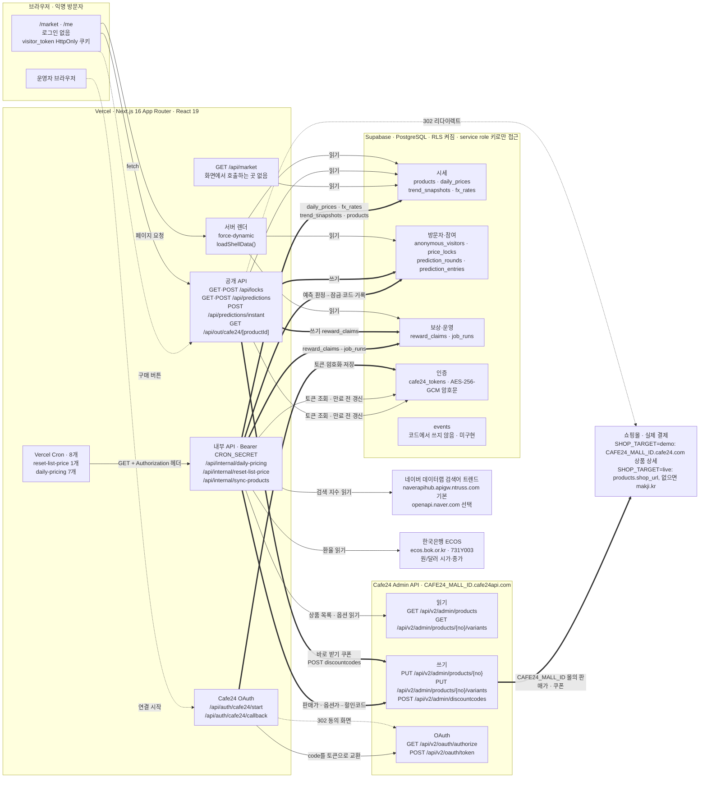
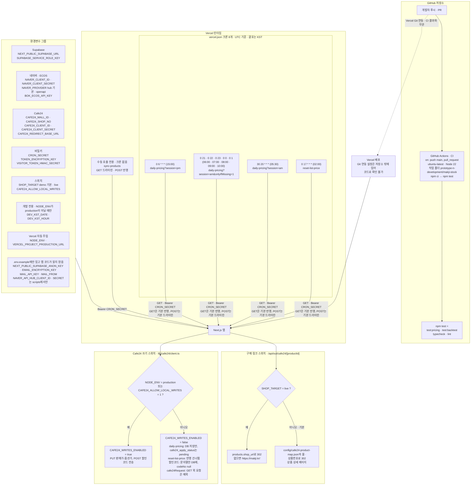
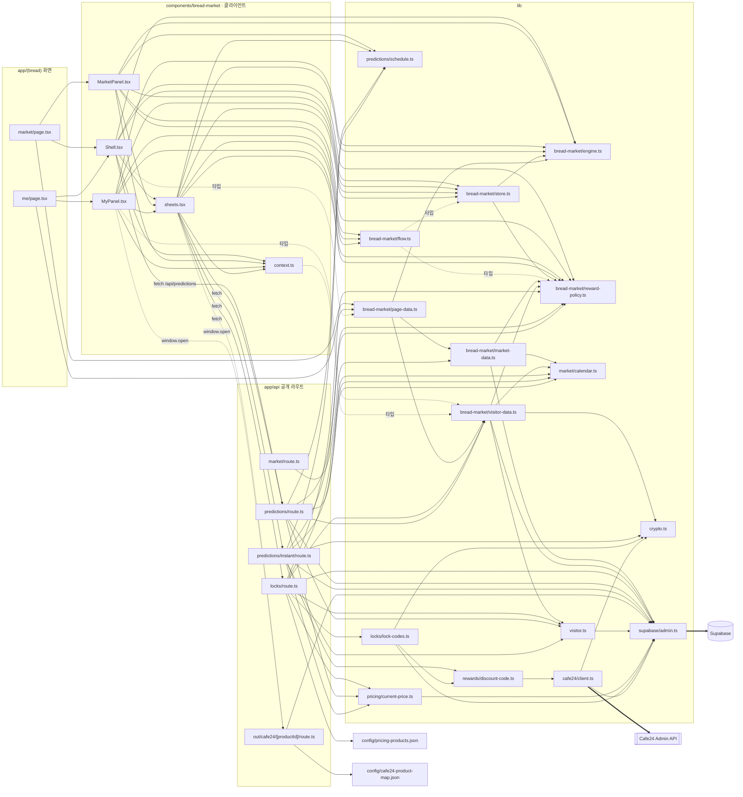
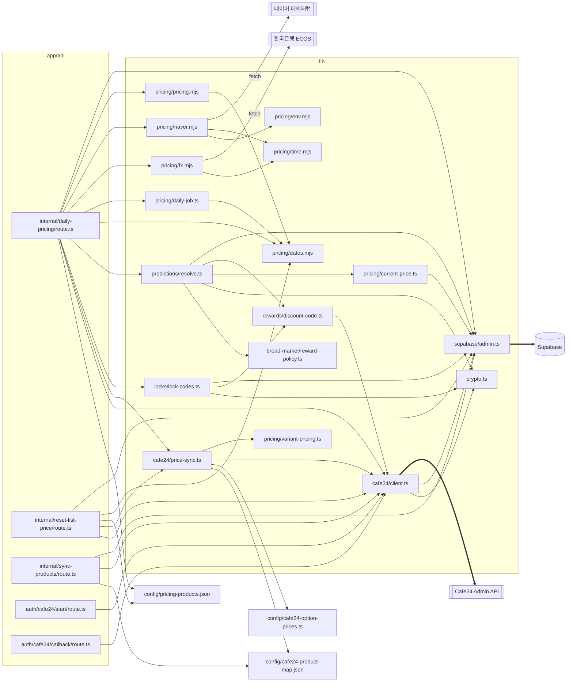

# 01. 시스템 아키텍처

- 대상 코드: `prototype-n-development/makji-stock/` (아래 경로는 모두 이 폴더 기준)
- 이 파일의 다이어그램: A1 시스템 컨텍스트 · A2 배포·운영 구성도 · A3 코드 모듈 의존도
- 기존 `assets/diagrams/시스템 아키텍처.pdf`는 A1로 옮겼다. PDF와 코드가 다른 부분은 코드를 따랐다.

화살표 규칙 (세 다이어그램 공통)

| 모양 | 뜻 |
|---|---|
| `-->` 실선 | 읽기, 호출 |
| `==>` 굵은 선 | 쓰기 (DB 저장, Cafe24 가격·쿠폰 반영) |
| `-.->` 점선 | 사용자 이동, 리다이렉트, 타입만 가져오기 |

---

## A1. 시스템 컨텍스트

**요약:** 가격은 크론이 외부 데이터를 모아 계산해 DB와 Cafe24에 쓰고, 화면은 서버 렌더가 DB를 읽어 첫 HTML에 담아 보낸다.

**근거 코드**

- 화면: `app/(bread)/market/page.tsx`, `app/(bread)/me/page.tsx`, `app/page.tsx`(`/market`으로 리다이렉트), `lib/bread-market/page-data.ts`
- 공개 API: `app/api/market/route.ts`, `app/api/locks/route.ts`, `app/api/predictions/route.ts`, `app/api/predictions/instant/route.ts`, `app/api/out/cafe24/[productId]/route.ts`
- 내부 API: `app/api/internal/daily-pricing/route.ts`, `app/api/internal/reset-list-price/route.ts`, `app/api/internal/sync-products/route.ts`
- Cafe24: `app/api/auth/cafe24/start/route.ts`, `app/api/auth/cafe24/callback/route.ts`, `lib/cafe24/client.ts`, `lib/cafe24/price-sync.ts`, `lib/rewards/discount-code.ts`
- 외부 데이터: `lib/pricing/naver.mjs`, `lib/pricing/fx.mjs`
- DB: `lib/supabase/admin.ts`, `supabase/rls.sql`, `supabase/migrations/001_cafe24_tokens.sql`
- 브라우저 호출: `components/bread-market/Shell.tsx`, `components/bread-market/sheets.tsx`, `components/bread-market/MyPanel.tsx`

**코드 대조일:** 2026-09-23

**읽는 법**

- 가격을 만드는 쪽은 크론과 내부 API다. 네이버·ECOS를 읽고, DB에 쓰고, Cafe24에 판매가를 반영한다. 화면을 그리는 쪽은 서버 렌더와 공개 API이며 DB만 읽는다.
- 공개 API 중 Cafe24에 쓰는 곳이 하나 있다. `POST /api/predictions/instant`(바로 받기)가 할인코드를 바로 만든다. 브라우저는 Supabase·Cafe24·네이버·ECOS를 직접 부르지 않는다.
- `SHOP_TARGET`은 구매 버튼이 보내는 주소만 바꾼다. 가격 반영(PUT)과 쿠폰 발급은 언제나 `CAFE24_MALL_ID` 몰로 간다.
- `events` 테이블은 스키마에만 있고, `fx_rates`·`trend_snapshots`는 쓰기만 하고 앱에서 다시 읽지 않는다(기록용).

---

## A2. 배포·운영 구성도

**요약:** `main` 푸시와 PR마다 GitHub Actions가 `npm test`를 돌리고, Vercel 크론 8개가 하루 가격 주기를 돌린다. Cafe24 쓰기는 `NODE_ENV`와 `CAFE24_ALLOW_LOCAL_WRITES`로 정해진다.

**근거 코드**

- CI: `/.github/workflows/ci.yml`(저장소 루트), `package.json`의 `test` 스크립트
- 크론: `vercel.json`
- 크론 인증·실행 모드: `app/api/internal/daily-pricing/route.ts:47-75`, `app/api/internal/reset-list-price/route.ts:30-38`, `app/api/internal/sync-products/route.ts:12-16`, `:92-102`
- 환경변수: `.env.example`, `lib/supabase/admin.ts`, `lib/cafe24/client.ts`, `lib/pricing/naver.mjs`, `lib/pricing/fx.mjs`, `lib/crypto.ts`, `lib/visitor.ts`, `lib/market/calendar.ts`
- 스위치: `app/api/out/cafe24/[productId]/route.ts:21`, `lib/cafe24/client.ts:170-185`, `lib/rewards/discount-code.ts:19-52`, `app/api/internal/daily-pricing/route.ts:310`, `app/api/internal/reset-list-price/route.ts:88`

**코드 대조일:** 2026-09-23

**크론 일정 (vercel.json)**

| UTC | KST | 경로 | 하는 일 |
|---|---|---|---|
| `0 17 * * *` | 02:00 | `/api/internal/reset-list-price` | Cafe24 판매가를 정가로 되돌린다 |
| `30 20 * * *` | 05:30 | `/api/internal/daily-pricing?session=am` | 오전가 계산·저장·반영, 전날 예측 판정 |
| `0 21 * * *` | 06:00 | `…?session=am&onlyIfMissing=1` | 오전가가 없는 상품만 다시 만든다 |
| `0 22 * * *` | 07:00 | 같음 | 같음 |
| `0 23 * * *` | 08:00 | 같음 | 같음 |
| `0 0 * * *` | 09:00 | 같음 | 같음 |
| `0 1 * * *` | 10:00 | 같음 | 같음 |
| `0 6 * * *` | 15:00 | `/api/internal/daily-pricing?session=pm` | 오후가 계산·저장·반영, 오전 잠금 차액 코드 발급, 예측 판정 |

**읽는 법**

- CI는 테스트만 돌린다. 배포 단계가 없으므로 Vercel 배포는 CI 성공과 묶여 있지 않다. Vercel 쪽 연동·루트 폴더 설정은 저장소에 없어 그리지 않았다.
- `CAFE24_WRITES_ENABLED`는 환경변수가 아니라 코드에서 계산하는 값이다. 실제로 켜고 끄는 환경변수는 `CAFE24_ALLOW_LOCAL_WRITES`다. 코드는 `NODE_ENV`만 보므로 `next dev`에서는 막히고, `NODE_ENV=production`으로 도는 배포에서는 열린다. Vercel은 프리뷰 배포도 기본으로 `NODE_ENV=production`으로 실행하므로, 코드 주석의 "로컬·프리뷰는 막는다"와 달리 프리뷰에서도 쓰기가 나갈 수 있다. 할인코드 접두사는 이 스위치와 별개로 `NODE_ENV`만 보고 정한다(production이면 `MJ`, 아니면 `MJT`).
- `SHOP_TARGET`은 구매 이동 라우트 한 곳에서만 읽는다. 가격 반영 대상 몰은 `CAFE24_MALL_ID`가 정한다. 내부 API는 헤더의 `CRON_SECRET`이 맞아야 실행되고, `CRON_SECRET`이 비어 있으면 모두 401을 돌려준다.

---

## A3. 코드 모듈 의존도

**요약:** 화면·라우트가 어떤 `lib/*` 모듈을 거쳐 Supabase·Cafe24·외부 API에 닿는지, 실제 `import` 문만 보고 그렸다. 요청 처리 경로(A3-1)와 자동 작업·운영 경로(A3-2)로 나눴다.

**근거 코드**

- `app/**/*.ts(x)`, `components/bread-market/*.tsx`, `lib/**/*.ts`, `lib/**/*.mjs`의 `import … from` 문 (grep으로 확인, 여러 줄 import 포함)
- 외부 호출 지점: `lib/supabase/admin.ts`(`createClient`), `lib/cafe24/client.ts`(`fetch …cafe24api.com`), `lib/pricing/naver.mjs`, `lib/pricing/fx.mjs`

**코드 대조일:** 2026-09-23

### A3-1. 요청 처리 경로 (화면 · 공개 API)

### A3-2. 자동 작업 · 운영 경로 (내부 API · Cafe24 OAuth)

**읽는 법**

- Supabase에 닿는 길은 `lib/supabase/admin.ts` 하나, Cafe24에 닿는 길은 `lib/cafe24/client.ts` 하나다. 쓰기 차단(`CAFE24_WRITES_ENABLED`)도 이 파일에서 한 번에 건다.
- 할인코드는 잠금 차액(`lock-codes.ts`), 예측 보상(`resolve.ts`), 바로 받기(`predictions/instant/route.ts`) 세 곳이 모두 `rewards/discount-code.ts`를 거쳐 만든다.
- `components/*`는 브라우저에서 돈다. `lib/bread-market/engine.ts`·`store.ts`·`flow.ts` 같은 화면 계산 모듈만 가져오고, DB 모듈은 타입만 가져온다. 서버 데이터는 `fetch`로 공개 API를 부른다.
- `lib/pricing/*.mjs`는 백테스트(`backtest/`)와 테스트(`tests/`)도 함께 쓰는 순수 계산 모듈이다. 이 그림에는 앱에서 가져오는 관계만 그렸다.
