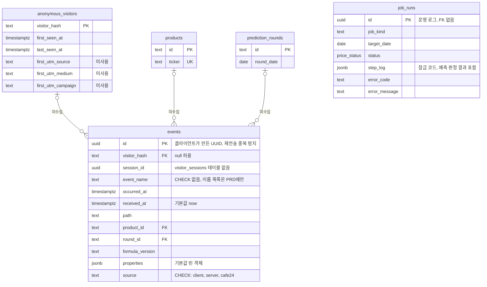
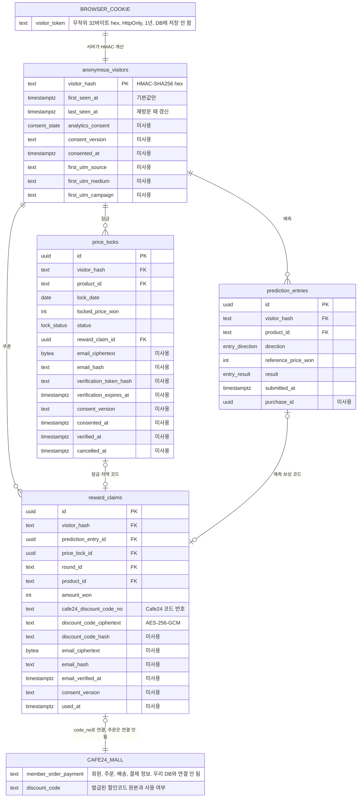

# 02. 데이터베이스 ERD

- 대상: MVP 앱 `prototype-n-development/makji-stock/`. 아래 경로는 모두 이 폴더 기준이다.
- 스키마 기준: `supabase/schema.sql`에 `supabase/migrations/001~007`을 차례로 적용한 **최종 상태**.
- 사용 여부 기준: `app/`, `lib/`에서 `supabaseAdmin().from("…")`로 읽고 쓰는 컬럼을 grep으로 확인했다. 코드가 읽지도 쓰지도 않는 컬럼은 "미사용", DB 기본값(`default now()` 등)으로만 채워지는 컬럼은 "기본값만"으로 적는다.
- 순서: E1 전체 ERD → E2 이벤트 데이터 → E3 고객 데이터

---

## E1. 전체 ERD

**한 줄 요약:** 테이블 12개가 `products`(상품)와 `anonymous_visitors`(익명 방문자)를 중심으로 이어지고, `reward_claims`(할인코드)는 예측·잠금·바로 받기 세 곳에서 만들어진다.

- 근거 파일: `supabase/schema.sql`, `supabase/migrations/001_cafe24_tokens.sql` ~ `007_reward_claim_product.sql`, `app/api/**/route.ts`, `lib/visitor.ts`, `lib/locks/lock-codes.ts`, `lib/predictions/resolve.ts`, `lib/bread-market/visitor-data.ts`, `lib/bread-market/market-data.ts`, `lib/pricing/current-price.ts`, `lib/cafe24/client.ts`
- 코드 대조일: 2026-09-23

### 테이블 그룹

| 그룹 | 테이블 | 하는 일 | 앱 코드 사용 |
|---|---|---|---|
| 시세 | `products` | 빵 6종의 정가, 검색 키워드, Cafe24 상품번호, 자사몰 주소(004) | 읽기·쓰기 (`sync-products`가 `cafe24_product_no` 갱신) |
| 시세 | `daily_prices` | 상품·날짜·세션(am/pm)별 확정 가격과 계산 근거 | 읽기·쓰기 |
| 시세 | `trend_snapshots` | 네이버 검색 지수 원본 | 쓰기만 (읽는 코드 없음, 기록용) |
| 시세 | `fx_rates` | ECOS 원/달러 시가·종가 | 쓰기만 (읽는 코드 없음, 기록용) |
| 참여 | `anonymous_visitors` | 쿠키 토큰의 HMAC 해시로 식별하는 익명 방문자 | 쓰기 (`lib/visitor.ts`) |
| 참여 | `price_locks` | 오전장 가격 잠금. 하루 1회 | 읽기·쓰기 |
| 참여 | `prediction_rounds` | 예측 회차. 첫 제출 때 upsert로 만든다 | 쓰기만 |
| 참여 | `prediction_entries` | 오를지·내릴지 예측과 판정 결과 | 읽기·쓰기 |
| 보상·운영 | `reward_claims` | 발급한 Cafe24 할인코드(암호화) | 읽기·쓰기 |
| 보상·운영 | `job_runs` | 크론 실행 기록(가격 산정, 정가 복귀) | 쓰기만 |
| 보상·운영 | `events` | 분석 이벤트 | **미사용 (스키마만 존재)** |
| 인증 | `cafe24_tokens` | Cafe24 OAuth 토큰(암호화). 001에서 추가, 002에서 컬럼명 변경 | 읽기·쓰기 (`lib/cafe24/client.ts`) |

### migration이 바꾼 것

| migration | 변경 |
|---|---|
| 001 | `cafe24_tokens` 추가, RLS 켜고 anon·authenticated 권한 회수 |
| 002 | `access_token`·`refresh_token` → `*_ciphertext`로 이름 변경 (기존 행 삭제) |
| 003 | `reward_claims.discount_code_ciphertext` 추가, `rate_pct` NOT NULL 해제 (잠금 차액 코드는 정액이라 null) |
| 004 | `products.shop_url` 추가 |
| 005 | `daily_prices.discount_pct` 0~38, `prediction_entries.reward_rate_pct` (0,5) — 둘 다 `schema.sql`에 이미 반영돼 있음 |
| 006 | `reward_rate_pct` 0~20으로 확장, `reward_claims.round_id` FK 추가, 부분 유니크 `(round_id, visitor_hash) where round_id is not null`, 출처 CHECK를 3개(예측·잠금·회차)로 확장 |
| 007 | `reward_claims.product_id` FK 추가 |

```mermaid
erDiagram
    products {
        text id PK
        text ticker UK
        text name
        int base_price_won "정가, 0보다 큼"
        int cafe24_product_no "데모몰 상품번호"
        int cafe24_shop_no "미사용, 환경변수로 대신함"
        text_arr keywords "네이버 검색 키워드"
        numeric list_margin_pct "할인 상한 계산"
        numeric min_margin_pct "할인 상한 계산"
        bool active
        text shop_url "004, SHOP_TARGET=live 때만"
        date valid_from "미사용"
        date valid_to "미사용"
    }
    trend_snapshots {
        uuid id PK
        text product_id FK
        date signal_date UK "UK: product_id+signal_date+request_start_date+request_end_date+keyword_group_version"
        numeric ratio
        date request_start_date UK
        date request_end_date UK
        text keyword_group_version UK
        text provider
        jsonb raw_payload "미사용"
    }
    fx_rates {
        date rate_date PK
        text item_code PK "0000002 시가, 0000003 종가"
        text rate_type "open 또는 close"
        numeric usd_krw
        jsonb raw_payload "미사용"
    }
    daily_prices {
        uuid id PK
        text product_id FK
        date publish_date UK "UK: product_id+publish_date+price_session+formula_version"
        price_session price_session UK "am, pm"
        text formula_version UK
        date signal_date
        numeric search_ratio
        numeric search_discount_pct
        numeric fx_decline_pct
        numeric fx_discount_pct
        numeric discount_pct "0~38"
        int price_won "10원 단위"
        int previous_price_won
        price_status status "코드는 calculated만 씀"
        cafe24_status cafe24_apply_status "pending, applied, failed"
        timestamptz published_at "미사용"
        timestamptz applied_at
    }
    job_runs {
        uuid id PK
        text job_kind "daily_pricing, reset_list_price"
        date target_date
        price_session price_session
        price_status status
        jsonb step_log
        text error_code
        int attempt_count "미사용, 기본값 1"
    }
    anonymous_visitors {
        text visitor_hash PK "HMAC-SHA256"
        timestamptz first_seen_at "기본값만"
        timestamptz last_seen_at
        consent_state analytics_consent "미사용"
        text first_utm_source "미사용"
    }
    price_locks {
        uuid id PK
        text visitor_hash FK,UK "UK: visitor_hash+lock_date"
        text product_id FK
        date lock_date UK
        price_session lock_session "코드는 am만 씀"
        int locked_price_won
        timestamptz protect_from
        timestamptz protect_until
        lock_status status "코드는 active, protecting만 씀"
        int lock_code_amount_won
        uuid reward_claim_id FK
        bytea email_ciphertext "미사용"
    }
    prediction_rounds {
        text id PK "예: 2026-09-23-am"
        date round_date UK "UK: round_date+target_session"
        price_session target_session UK
        date target_publish_date
        round_status status "코드는 open만 씀"
        timestamptz closes_at
        text resolution_version "미사용"
        text void_reason "미사용"
    }
    prediction_entries {
        uuid id PK
        text round_id FK,UK "부분 UK: round_id+visitor_hash, role=general"
        uuid purchase_id UK "미사용, 부분 UK role=buyer"
        entry_role role "코드는 general만 씀"
        text visitor_hash FK,UK
        text product_id FK
        entry_direction direction "up, down"
        int reference_price_won
        date target_publish_date
        price_session target_session "코드는 am만 씀"
        entry_result result "pending, hit, miss, void"
        smallint reward_rate_pct "0~20, 006"
    }
    reward_claims {
        uuid id PK
        uuid prediction_entry_id FK,UK "부분 UK, 예측 보상"
        uuid price_lock_id FK,UK "부분 UK, 잠금 차액"
        text round_id FK,UK "006, 부분 UK: round_id+visitor_hash, 바로 받기"
        text product_id FK "007, 바로 받기만 채움"
        text visitor_hash FK,UK
        smallint rate_pct "003부터 null 허용"
        int amount_won
        text cafe24_discount_code_no
        text discount_code_ciphertext "003, AES-256-GCM"
        timestamptz valid_until
        claim_status status "코드는 issued만 씀"
    }
    events {
        uuid id PK "미사용 테이블"
        text visitor_hash FK
        text product_id FK
        text round_id FK
        text event_name
        text source "client, server, cafe24"
    }
    cafe24_tokens {
        text mall_id PK
        text access_token_ciphertext "002, AES-256-GCM"
        text refresh_token_ciphertext "002, AES-256-GCM"
        timestamptz access_token_expires_at
        timestamptz refresh_token_expires_at
    }

    products ||--o{ trend_snapshots : "검색 지수"
    products ||--o{ daily_prices : "확정 가격"
    products ||--o{ price_locks : "잠금 대상"
    products ||--o{ prediction_entries : "예측 대상"
    products |o--o{ reward_claims : "바로 받기 쿠폰 상품"
    products |o--o{ events : "미사용"
    anonymous_visitors ||--o{ price_locks : "잠금"
    anonymous_visitors ||--o{ prediction_entries : "예측"
    anonymous_visitors ||--o{ reward_claims : "쿠폰 소유"
    anonymous_visitors |o--o{ events : "미사용"
    prediction_rounds |o--o{ prediction_entries : "회차"
    prediction_rounds |o--o{ reward_claims : "바로 받기 회차"
    prediction_rounds |o--o{ events : "미사용"
    prediction_entries |o--o| reward_claims : "예측 보상 1회"
    price_locks |o--o| reward_claims : "price_lock_id, 잠금 1회"
    reward_claims |o--o| price_locks : "reward_claim_id 역참조"
```

**읽는 법**

- 선 모양은 FK 기준이다. `||--o{`는 "하나에 여러 개", `|o--o|`는 "0 또는 1개"다. `fx_rates`·`job_runs`·`cafe24_tokens`는 FK가 없다. `daily_prices`의 `fx_*` 컬럼은 `fx_rates` 값을 복사해 두는 것이지 FK로 잇지 않는다.
- `reward_claims`는 CHECK로 `prediction_entry_id`·`price_lock_id`·`round_id` 중 하나는 반드시 채운다(006). 출처마다 부분 유니크 인덱스가 있어 예측 1건·잠금 1건·회차당 방문자 1명에 코드 1장만 나간다. 바로 받기와 예측을 같은 회차에 둘 다 하는 것은 서로 다른 테이블이라 DB가 못 막고 앱이 막는다(`app/api/predictions/route.ts`, `instant/route.ts`).
- `price_locks`와 `reward_claims`는 서로를 가리킨다. 코드는 코드 발급 뒤 `price_locks.reward_claim_id`를 채우고, 이 값이 비어 있는 잠금만 다시 발급 대상으로 본다(`lib/locks/lock-codes.ts`).
- 표에 없는 컬럼(예: `daily_prices`의 `fx_previous_date` 등 계산 근거 컬럼)은 E1에서 생략했다. 개인 정보 관련 컬럼 전체는 E3, `events` 전체는 E2에 있다.

---

## E2. 이벤트 데이터 ERD (마케팅·분석용)

**한 줄 요약:** `events` 테이블은 스키마에만 있고 앱 코드가 한 줄도 쓰지 않는다 — **스키마만 존재·미수집**. 지금 분석에 쓸 수 있는 행동 기록은 `price_locks`·`prediction_entries`·`reward_claims` 같은 업무 테이블뿐이다.

- 근거 파일: `supabase/schema.sql`(`events`), `supabase/rls.sql`, `docs/PRD-브레드마켓.md` §21(저장소 루트 기준), `app/api/out/cafe24/[productId]/route.ts`, `app/api/internal/daily-pricing/route.ts`, `app/api/internal/reset-list-price/route.ts`
- 확인 방법: `app/`, `lib/`, `components/`에서 `from("events")`, `event_name`, `page_view`, `prediction_submit`을 grep — 결과 없음. `@vercel/analytics`·gtag 같은 외부 분석 도구도 없다.
- 코드 대조일: 2026-09-23

### `source` 값

| 값 | 뜻 (PRD §21.2) | 현재 |
|---|---|---|
| `client` | 브라우저가 보낸 이벤트(`page_view` 등). 컬럼 기본값 | 미수집 — 수집 API 라우트가 없다 |
| `server` | 서버가 저장 성공 뒤 남기는 이벤트(`prediction_submit` 등) | 미수집 |
| `cafe24` | Cafe24 주문 웹훅·동기화(`purchase_completed`) | 미수집 — 주문 연동 없음 |

### PRD §21 이벤트와 현재 대신 볼 수 있는 데이터

| PRD 이벤트 | 퍼널(§21.3) | `events` 저장 | 지금 대신 볼 수 있는 곳 |
|---|---|---|---|
| `page_view` | 1단계 | 미수집 | 없음. `anonymous_visitors`는 잠금·예측·바로 받기 때만 만들어져 방문자 수가 아니다 |
| `prediction_submit` | 2단계 | 미수집 | `prediction_entries.submitted_at` |
| `product_click` | 3단계 | 미수집 | 없음 |
| `purchase_link_click` | 4단계 | 미수집 | 없음. `/api/out/cafe24/[productId]`는 302 이동만 한다(route.ts 6~8행 주석) |
| `purchase_completed` | 5단계 | 미수집 | 없음. Cafe24 주문 연동 없음 |
| `price_lock_start` | — | 미수집 | 없음 |
| `price_lock_created` | — | 미수집 | `price_locks.locked_at` |
| `price_lock_verified` | — | 미수집 | 해당 없음. 이메일 인증을 구현하지 않았고 잠금은 바로 `active` |
| `price_lock_resolved` | — | 미수집 | `price_locks.status='protecting'`, `current_price_won_at_protect`, `job_runs.step_log.lockCodes` |
| `lock_code_sent` | — | 미수집 | `reward_claims` (`price_lock_id` 있음, `sent_at`) |
| `coupon_click` | — | 미수집 | 없음. 코드는 버튼 없이 MY 화면에 바로 뜬다 |
| `result_view` | — | 미수집 | 없음 |
| `reward_email_verified` | — | 미수집 | 해당 없음. 이메일 발송 없음 |
| `reward_coupon_sent` | — | 미수집 | `reward_claims` (`prediction_entry_id` 있음, `sent_at`) |
| `reward_claim_failed` | — | 미수집 | `job_runs.step_log.predictions[].code='failed'` |
| (PRD에 없음) 바로 받기 | — | — | `reward_claims` (`round_id` 있음) |

### 운영 로그와의 구분

| 테이블 | 성격 | 누가 쓰나 |
|---|---|---|
| `events` | 사용자 행동 분석(마케팅) | 없음 |
| `job_runs` | 크론 실행 로그(운영). 방문자와 연결되지 않는다 | `daily-pricing`, `reset-list-price` 라우트가 실행마다 1행 insert 후 update |

**읽는 법**

- `events`의 FK 3개는 모두 null을 허용한다. 서버 이벤트는 방문자 없이, 페이지 이벤트는 상품 없이 남길 수 있게 만든 구조다. `event_name`에는 CHECK가 없어 이름 목록은 PRD §21.1에만 있다.
- `job_runs`는 분석 이벤트가 아니다. 다만 `step_log`에 잠금 코드 발급 결과와 예측 판정 결과가 JSON으로 남아, 이벤트가 없는 지금은 운영 추적용으로 쓸 수 있다.
- PRD의 `visitor_sessions`, `purchase_attributions` 테이블은 없다(`schema.sql` 머리 주석에서 1차 범위 밖으로 뺐다). 그래서 `events.session_id`는 FK 없는 빈 칸이다.

---

## E3. 고객 데이터 ERD (개인 정보 관리)

**한 줄 요약:** 우리 DB에는 이름·이메일·연락처·IP가 없다. 방문자는 쿠키 토큰의 HMAC 해시로만 식별하고, 회원·주문·결제 정보는 Cafe24에만 있다. 이메일 컬럼은 스키마에 있지만 코드가 채우지 않는다.

- 근거 파일: `supabase/schema.sql`, `supabase/migrations/003·006·007`, `supabase/rls.sql`, `supabase/migrations/001_cafe24_tokens.sql`, `lib/visitor.ts`, `lib/crypto.ts`, `lib/supabase/admin.ts`, `lib/locks/lock-codes.ts`, `lib/predictions/resolve.ts`, `app/api/predictions/instant/route.ts`, `lib/bread-market/visitor-data.ts`, `lib/cafe24/client.ts`
- 코드 대조일: 2026-09-23

`BROWSER_COOKIE`와 `CAFE24_MALL`은 우리 DB 테이블이 아니다. 경계를 보여주려고 그렸다.

### 컬럼별 개인 정보 표

| 테이블.컬럼 | 개인 정보 여부 | 저장 방식 | 코드가 채우나 | 보관 위치 |
|---|---|---|---|---|
| (쿠키) `visitor_token` | 온라인 식별자 | 원문. `randomBytes(32)` hex, HttpOnly·SameSite=Lax·1년 (`lib/visitor.ts` 38~47행) | 채움 | 브라우저에만. DB 저장 안 함 |
| `anonymous_visitors.visitor_hash` | 가명 식별자 (PRD §21.4: 개인정보처리방침 검토 대상) | HMAC-SHA256(토큰, `VISITOR_TOKEN_HMAC_SECRET`) hex (`lib/visitor.ts` 19행) | 채움. 잠금·예측·바로 받기 요청 때만 만든다 | 우리 DB |
| `anonymous_visitors.first_seen_at`, `last_seen_at` | 행동 기록 | 평문 | `first_seen_at`은 기본값만, `last_seen_at`은 재방문 때 upsert | 우리 DB |
| `anonymous_visitors.analytics_consent`, `consent_version`, `consented_at` | 동의 기록 | 평문 | **미사용** (항상 `unknown`/null) | 우리 DB |
| `anonymous_visitors.first_utm_source`·`_medium`·`_campaign` | 유입 경로 | 평문 | **미사용** | 우리 DB |
| `price_locks.*` (상품, 날짜, 잠금가, 상태) | 가명 식별자에 묶인 행동 기록 | 평문 | 채움 (`app/api/locks/route.ts`, `lib/locks/lock-codes.ts`) | 우리 DB |
| `price_locks.email_ciphertext`, `email_hash` | 개인 정보 (이메일) | 설계상 암호화·해시. 암호화 함수를 부르는 코드 없음 | **미사용** | 우리 DB (비어 있음) |
| `price_locks.verification_token_hash`, `verification_expires_at`, `verified_at`, `consent_version`, `consented_at`, `cancelled_at` | 인증·동의 기록 | 해시·평문 | **미사용** (이메일 인증 없음, 잠금은 바로 `active`) | 우리 DB (비어 있음) |
| `prediction_entries.*` (상품, 방향, 기준가, 결과) | 가명 식별자에 묶인 행동 기록 | 평문 | 채움 (`app/api/predictions/route.ts`, `lib/predictions/resolve.ts`) | 우리 DB |
| `prediction_entries.purchase_id` | 구매 연결 | — | **미사용** (buyer 예측 없음) | 우리 DB (비어 있음) |
| `reward_claims.discount_code_ciphertext` | 개인 정보는 아니지만 돈이 되는 비밀값 | AES-256-GCM, `encryptSecret` (`lib/crypto.ts`), 키 `TOKEN_ENCRYPTION_KEY` | 채움 (`lock-codes.ts` 135행, `resolve.ts` 161행, `instant/route.ts` 133행). MY 화면에서만 복호화 (`visitor-data.ts`) | 우리 DB (원본은 Cafe24) |
| `reward_claims.cafe24_discount_code_no` | 아님 (Cafe24 내부 번호) | 평문 | 채움 | 우리 DB |
| `reward_claims.discount_code_hash` | — | — | **미사용** (003부터 암호문으로 대체) | 우리 DB (비어 있음) |
| `reward_claims.email_ciphertext`, `email_hash`, `email_verified_at`, `consent_version` | 개인 정보 (이메일) | 설계상 암호화·해시 | **미사용** | 우리 DB (비어 있음) |
| `reward_claims.used_at` | 구매 여부 | — | **미사용** (사용 여부는 Cafe24만 안다) | 우리 DB (비어 있음) |
| `cafe24_tokens.access_token_ciphertext`, `refresh_token_ciphertext` | 개인 정보 아님. 몰 관리자 권한 비밀값 | AES-256-GCM, `encryptSecret` (`lib/cafe24/client.ts` 107~108행) | 채움 | 우리 DB |
| 회원·주문·배송·결제 정보 | 개인 정보 | — | 우리 코드가 읽지 않음 | Cafe24만 |
| IP 주소 | 개인 정보 | — | 저장하지 않음 (코드에 IP 처리 없음) | 없음 |

### 브라우저 접근 차단 (RLS)

| 항목 | 확인 내용 | 근거 |
|---|---|---|
| RLS | 12개 테이블 모두 켜져 있다. 정책은 하나도 없다 | `supabase/rls.sql` 13~23행(11개), `migrations/001` 16행(`cafe24_tokens`) |
| 권한 | `anon`·`authenticated`의 테이블·시퀀스 권한을 모두 회수 | `rls.sql` 26~27행, `001` 23행 |
| 서버 접근 | 모든 읽기·쓰기는 서버 라우트에서 `service_role` 키로 한다. 키에 `NEXT_PUBLIC_` 접두사 없음 | `lib/supabase/admin.ts` |
| 브라우저 접근 | `"use client"` 파일 중 Supabase를 부르는 곳 없음 | `app/`, `components/` grep |

즉 브라우저가 anon 키로 PostgREST에 직접 들어와도 어떤 테이블도 읽거나 쓸 수 없다.

**읽는 법**

- "미사용"으로 표시한 이메일·동의·UTM·인증 컬럼은 모든 행에서 비어 있다. 이 중 **이메일·인증 컬럼은 2026-09-23 이메일 기능 폐기 결정으로 제거 대상**이다. 동의·UTM 컬럼은 [05 F-A3](05-future-design.md#f-a3-방문자-분석-동의최초-utmvisitor_sessions)에서 채울 예정이다.
- 방문자와 Cafe24 회원·주문을 잇는 컬럼은 없다. `reward_claims.cafe24_discount_code_no`로 "어떤 코드를 발급했는지"만 Cafe24와 맞춰 볼 수 있고, 누가 샀는지는 알 수 없다.
- 이메일 컬럼 타입이 `bytea`인데 `lib/crypto.ts`의 `encryptSecret`은 base64 **문자열**을 돌려준다. 이메일 기능은 폐기했으므로 이 컬럼들은 타입을 맞추지 않고 제거하면 된다.
- 쿠키를 지우면 같은 사람이어도 새 `visitor_hash`가 생긴다. 옛 행은 남지만 누구 것인지 다시 알 방법이 없다.
