# 03. 핵심 기능별 시퀀스 다이어그램 (S1~S9)

MVP 앱(`prototype-n-development/makji-stock/`)의 핵심 기능을 라우트 핸들러부터 lib 함수, Supabase 테이블, Cafe24·외부 API까지 실제 호출 순서대로 그렸다. 아래 경로는 모두 `prototype-n-development/makji-stock/` 기준이다.

공통 표기

- `SB`는 Supabase다. 서버는 모두 `supabaseAdmin()`(service_role)으로 접근한다.
- `C24`는 Cafe24 Admin API(`https://{mall}.cafe24api.com`)다. 모든 호출은 `cafe24Request()`를 거치며, 토큰 조회·갱신 과정은 S7에 한 번만 그렸다.
- 크론 시각은 `vercel.json`(UTC)을 KST(UTC+9)로 바꿔 함께 적었다. Hobby 요금제라 지정 시각이 아니라 그 시간대 안의 아무 때나 실행된다(`lib/pricing/daily-job.ts` `resolveSession` 주석).
- 응답 코드와 에러 문구는 코드에 있는 그대로 옮겼다.
- `Note`의 "미구현"은 코드 주석이 직접 "아직/나중에/지금은 ~만" 등으로 밝힌 부분만 표시했다.

| 크론 경로 | UTC | KST | 다이어그램 |
|---|---|---|---|
| `/api/internal/reset-list-price` | 17:00 | 02:00 | S4 |
| `/api/internal/daily-pricing?session=am` | 20:30 | 05:30 (05시대) | S2 |
| `/api/internal/daily-pricing?session=am&onlyIfMissing=1` | 21:00, 22:00, 23:00, 00:00, 01:00 | 06:00, 07:00, 08:00, 09:00, 10:00 (5회) | S2 |
| `/api/internal/daily-pricing?session=pm` | 06:00 | 15:00 (15시대) | S3 |

---

## S1. 첫 화면 렌더

**요약:** `/market`·`/me` 요청 때 서버가 시세·잠금·예측·바로 받기 쿠폰을 한꺼번에 읽어 첫 HTML에 싣는다. 쿠키는 읽기만 하고 새로 발급하지 않는다.

**근거 코드:** `app/page.tsx:HomePage`, `app/(bread)/market/page.tsx:MarketPage`, `app/(bread)/me/page.tsx:MePage`, `lib/bread-market/page-data.ts:loadShellData`, `lib/bread-market/market-data.ts:loadMarketData`, `lib/bread-market/visitor-data.ts:loadLock·loadPredictions·loadInstantRewards`, `lib/visitor.ts:readVisitorHash`, `components/bread-market/Shell.tsx:BreadMarketShell`

**코드 대조일:** 2026-09-23

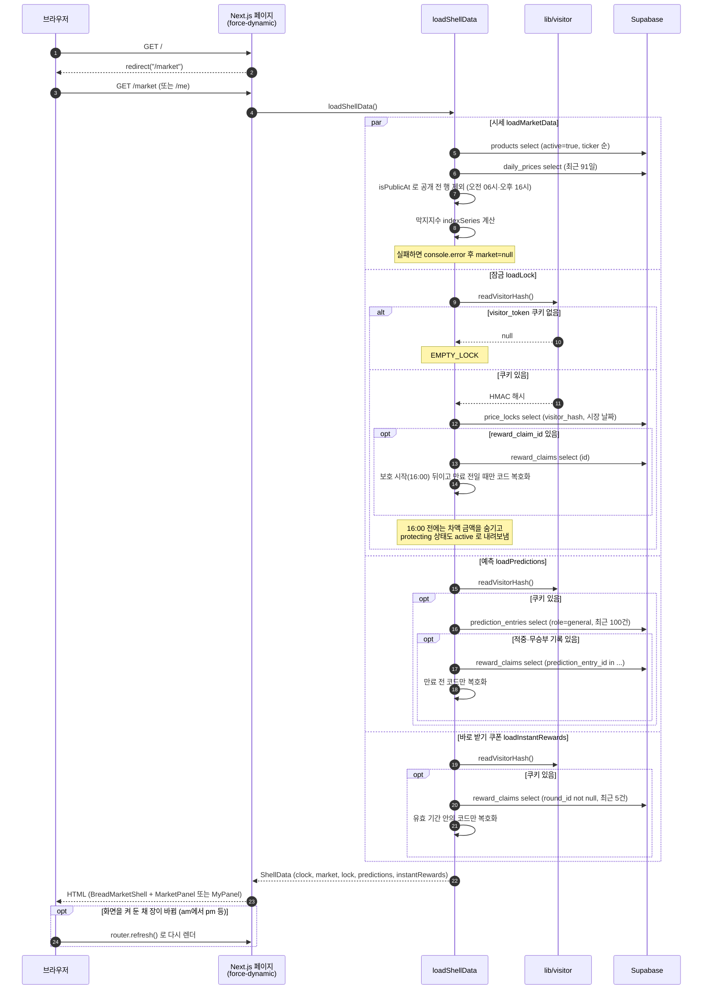

**읽는 법**

- 네 가지 조회는 `Promise.all`로 동시에 돌고, 하나가 실패해도 빈 값으로 대신해 나머지는 그린다.
- 첫 방문자는 쿠키가 없어 잠금·예측이 빈 값으로 나온다. `visitor_token` 발급은 S5·S6의 라우트 핸들러에서만 일어난다.
- 오후가는 15시대에 이미 DB에 있어도 16:00 전에는 `isPublicAt`이 걸러 화면과 `/api/market` 어디에도 나가지 않는다.

---

## S2. 오전 가격 산정 (05시대, `onlyIfMissing=1` 재시도 포함)

**요약:** 05시대 크론이 네이버 검색지수(D-2)와 ECOS 환율을 모아 오전가를 계산·저장하고, Cafe24 판매가·옵션가를 바꾼 뒤, 밀린 예측을 판정해 보상 코드를 발급한다. 06~10시에는 보류된 상품만 다시 만든다.

**근거 코드:** `app/api/internal/daily-pricing/route.ts:GET·run`, `lib/pricing/daily-job.ts:resolveSession·searchSignalDateOf·marginCapPct·pickPreviousPrices`, `lib/pricing/naver.mjs:fetchTrendsSeparately`, `lib/pricing/fx.mjs:fetchUsdKrwOpenCloseRates`, `lib/pricing/pricing.mjs:buildSessionFxSignals·resolveSearchRatio·calculateDay`, `lib/cafe24/price-sync.ts:syncCafe24ProductPrice`, `lib/predictions/resolve.ts:resolvePredictions`, `lib/pricing/current-price.ts:currentPriceOf`, `lib/rewards/discount-code.ts:createDiscountCode`

**코드 대조일:** 2026-09-23

```mermaid
sequenceDiagram
    autonumber
    participant CR as Vercel Cron
    participant R as daily-pricing 라우트
    participant SB as Supabase
    participant NV as 네이버 검색어 트렌드
    participant EC as 한국은행 ECOS
    participant C24 as Cafe24 Admin API

    CR->>R: GET ?session=am (UTC 20:30 = KST 05시대)
    Note over CR,R: 재시도 GET ?session=am&onlyIfMissing=1<br/>UTC 21·22·23·00·01시 = KST 06·07·08·09·10시
    alt Authorization 이 Bearer CRON_SECRET 과 다름
        R-->>CR: 401 {"error":"unauthorized"}
    end
    Note over R: GET 은 commit 기본값 1, 수동 POST 는 드라이런이 기본
    R->>SB: job_runs insert (daily_pricing, am, collecting)
    R->>SB: products select (active=true)
    alt 조회 오류 또는 0건
        R->>SB: job_runs update (held, error_code=pipeline)
        R-->>CR: 502 {error:"활성 상품이 없습니다.", stage:"pipeline"}
    end
    opt onlyIfMissing=1
        R->>SB: daily_prices select (오늘, am)
        R->>R: 이미 확정가가 있는 상품 제외
        alt 남은 상품 없음 (멱등 스킵)
            R->>SB: job_runs update (completed)
            R-->>CR: 200 {mode:"skipped", reason:"이미 확정가가 있습니다."}
        end
    end
    loop 상품마다 따로 1회
        R->>NV: POST 검색어 트렌드 (D-2까지 90일, 상품 키워드 1그룹)
    end
    R->>EC: GET StatisticSearch 매매기준율 종가 (오늘-12일부터 오늘까지)
    R->>EC: GET StatisticSearch 시가
    Note over R,EC: 네트워크 오류·5xx 는 최대 4회 재시도
    R->>R: buildSessionFxSignals 로 오전 환율 신호
    alt 오전 환율 신호 없음
        R->>SB: job_runs update (held, fx_unavailable)
        R-->>CR: 200 {mode:"held", reason:"직전 두 영업일 종가를 찾지 못했습니다."}
    end
    loop 상품마다
        alt 90일 창 전체에 검색지수 없음
            R->>R: 보류 "검색지수 관측 이력 없음"
        else D-2 지수가 없어 이월값뿐
            R->>R: 보류 "검색지수 미도착"
        else 지수 있음
            R->>R: marginCapPct 로 할인 상한, calculateDay 로 판매가
        end
    end
    R->>SB: fx_rates upsert (rate_date, item_code)
    R->>SB: trend_snapshots upsert (계산된 상품만)
    R->>SB: daily_prices select (오늘 이전, 직전 확정가)
    R->>SB: daily_prices upsert (calculated, cafe24_apply_status=pending)
    Note over R,SB: 멱등 키 (product_id, publish_date, price_session, formula_version)
    alt upsert 오류
        R-->>CR: 502 {error:"daily_prices 저장 실패: ..."}
    end
    opt commit
        loop 계산된 상품마다
            alt cafe24_product_no 없음
                R->>R: skipped "cafe24_product_no 없음"
            else CAFE24_WRITES_ENABLED 가 false (로컬·프리뷰)
                R->>R: skipped "로컬 — 실몰 반영 생략" (pending 유지)
            else 반영
                opt 옵션 정가 설정(config/cafe24-option-prices.ts)이 있음
                    R->>C24: GET /api/v2/admin/products/{no}/variants
                    R->>R: 옵션별 판매가와 추가금 계산, 누락·불일치면 오류
                    Note over R: 미구현 — 데모몰 샘플 상품에는 옵션이 없어<br/>옵션이 2개 이상인 상품은 대표가만 반영
                end
                R->>C24: PUT /api/v2/admin/products/{no} (price)
                opt 옵션 갱신 대상 있음
                    R->>C24: PUT /api/v2/admin/products/{no}/variants (additional_amount)
                end
                alt 성공
                    R->>SB: daily_prices update (applied, applied_at)
                else 실패
                    R->>SB: daily_prices update (failed)
                end
            end
        end
    end
    R->>SB: prediction_entries select (general, pending, 오늘 이하, target_session=am)
    loop 판정 대상 예측마다
        alt 대상일이 오늘
            R->>R: 방금 계산한 오전가 사용
        else 밀린 날짜
            R->>SB: daily_prices select (그날 am)
        end
        opt 결과가 없음
            R->>R: 건너뜀 (다음 실행에서 다시 판정)
        end
        R->>R: resolveDirection (같은 가격이면 void 무승부)
        R->>R: 보상률 = 제출 때 약속한 값, 빗나감이면 0
        opt commit
            R->>SB: prediction_entries update (result, result_price_won, resolved_at)
            alt 판정 저장 실패
                R->>R: 코드 발급 안 함, pending 유지
            else 보상 0원 또는 cafe24_product_no 없음
                R->>R: code none
            else 보상 있음
                alt CAFE24_WRITES_ENABLED 가 false
                    R->>R: 코드 문자열만 생성 (codeNo=null)
                else
                    R->>C24: POST /api/v2/admin/discountcodes (정액, 상품 1개, 1회, 24시간)
                end
                R->>SB: reward_claims insert (prediction_entry_id, 암호화한 코드)
                R->>R: 600ms 대기 (호출 한도)
            end
        end
    end
    R->>SB: job_runs update (completed 또는 partially_failed, step_log)
    R-->>CR: 200 {mode:"committed", fx, makjiIndex, products, cafe24, predictions}
    Note over R: 이 사이 어디서든 예외가 나면 job_runs held (pipeline) 후 502
```

**읽는 법**

- 06~10시 재시도(`onlyIfMissing=1`)는 이미 확정가가 있는 상품을 빼고 돈다. 공개된 가격을 다시 덮어쓰지 않기 위해서다. 남은 상품이 없으면 외부 API를 부르지 않고 바로 끝난다.
- 검색지수가 D-2까지 오지 않은 상품은 가격을 만들지 않고 보류한다. 화면은 그동안 정가를 보여주고, 다음 재시도에서 다시 만든다.
- 예측은 모두 `target_session=am`이라 판정은 이 오전 크론에서만 일어난다. 크론을 건너뛴 날의 pending도 그날 확정가를 DB에서 읽어 함께 처리한다.
- Cafe24 호출 전 토큰 조회·갱신은 S7 아래쪽 흐름을 따른다.

---

## S3. 오후 가격 산정과 잠금 차액 코드 발급

**요약:** 15시대 크론이 당일 시가로 오후가를 계산·반영한 뒤, 오전 잠금 중 오후가가 잠금가보다 오른 건에 차액 정액 할인코드를 발급한다.

**근거 코드:** `app/api/internal/daily-pricing/route.ts:run`, `lib/locks/lock-codes.ts:issueLockCodes`, `lib/rewards/discount-code.ts:createDiscountCode`, `lib/predictions/resolve.ts:resolvePredictions`

**코드 대조일:** 2026-09-23

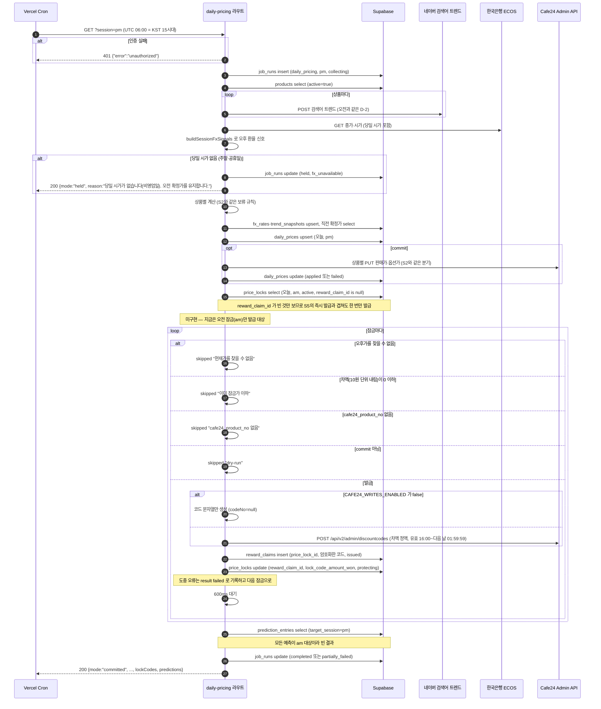

**읽는 법**

- 오후 크론도 네이버를 다시 부른다. 검색지수 날짜는 오전과 같은 D-2라 오전·오후 차이는 환율(전날 종가 대비 당일 시가)에서 나온다.
- 차액 코드는 15시대에 발급되지만 화면에는 16:00부터 보인다(S1 `loadLock`).
- 크론이 지나간 뒤 15:59까지 걸린 잠금은 이 명단에 없다. 그 잠금은 S5에서 잠그는 순간 바로 발급한다.

---

## S4. 02:00 정가 복귀

**요약:** 02시 크론이 모든 활성 상품의 Cafe24 판매가·옵션가를 정가(할인 0%)로 되돌린다.

**근거 코드:** `app/api/internal/reset-list-price/route.ts:GET·run`, `lib/cafe24/price-sync.ts:syncCafe24ProductPrice`

**코드 대조일:** 2026-09-23

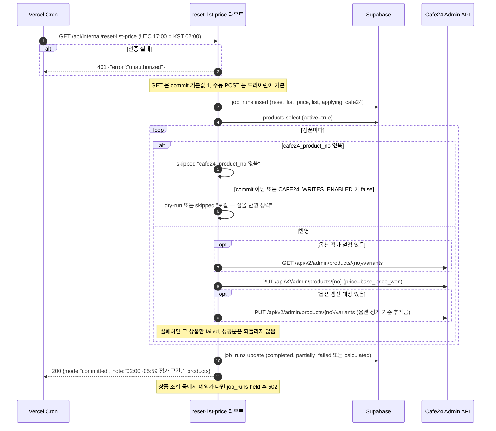

**읽는 법**

- `daily_prices`에는 아무것도 쓰지 않는다. 몰 가격을 정가로 덮을 뿐이라 두 번 돌아도 결과가 같다.
- 잠금 차액 코드는 여기서 만들지 않는다(S3에서 발급).
- 이 시각 이후 오전가가 나올 때까지(S2) 몰과 화면은 정가다.

---

## S5. 가격 잠금 (`visitor_token` 발급 포함)

**요약:** 오전장에 손님이 빵 하나의 현재 오전가를 잠근다. 쿠키가 없으면 이때 `visitor_token`을 발급하고, 오후가가 이미 나와 있으면 그 자리에서 차액 코드를 발급한다.

**근거 코드:** `app/api/locks/route.ts:POST·tickerToProductId·protectionWindow`, `lib/market/calendar.ts:kstNow`, `lib/bread-market/reward-policy.ts:lockOpensOn`, `lib/pricing/current-price.ts:currentPriceOf`, `lib/visitor.ts:getOrCreateVisitorHash`, `lib/locks/lock-codes.ts:issueLockCodes`, `components/bread-market/sheets.tsx:confirm`

**코드 대조일:** 2026-09-23

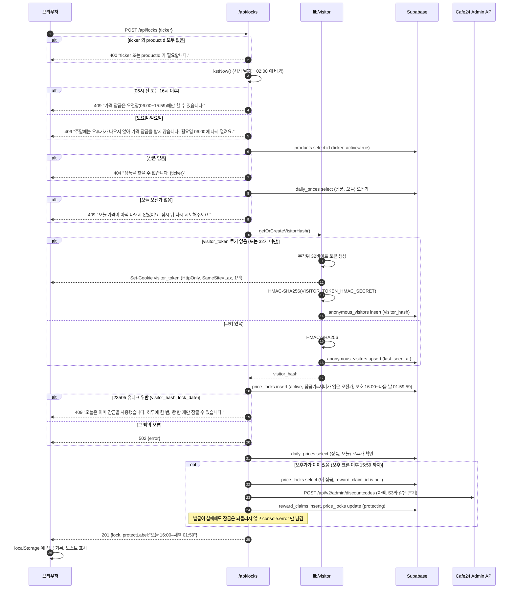

**읽는 법**

- 잠금가는 브라우저가 보내지 않는다. 서버가 `daily_prices`에서 읽는다.
- 하루 1회 제한은 앱 코드가 아니라 `price_locks (visitor_hash, lock_date)` 유니크 제약이 막고, 라우트는 `23505`를 409로 바꿔 돌려준다.
- 즉시 발급은 오후가가 실제로 있을 때만 한다. 주말처럼 오전가로 대신 채워진 경우(`session`이 am)는 대상이 아니다.

---

## S6. 가격 예측 제출과 바로 받기

**요약:** 손님은 한 회차에 "내일 06:00 오전가가 오를까 내릴까" 예측과 "바로 받기"(확정 쿠폰) 중 하나만 고를 수 있다. 예측 판정과 보상 발급은 S2 오전 크론에서 한다.

**근거 코드:** `app/api/predictions/route.ts:POST·GET`, `app/api/predictions/instant/route.ts:POST`, `lib/predictions/schedule.ts:predictionSchedule`, `lib/pricing/current-price.ts:currentPriceOf`, `lib/bread-market/reward-policy.ts:rollPredictionRewardPct·instantRewardPct·couponAmountWon·instantCodeValidUntil`, `lib/visitor.ts:getOrCreateVisitorHash`, `lib/rewards/discount-code.ts:createDiscountCode`, `components/bread-market/sheets.tsx:vote·takeNow`

**코드 대조일:** 2026-09-23

### S6-a. 예측 제출

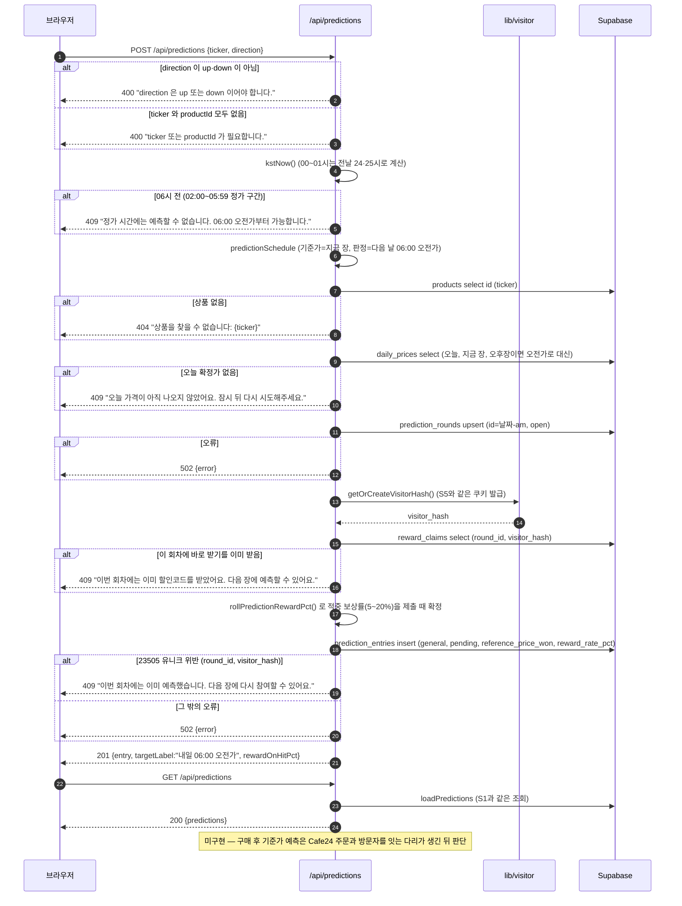

### S6-b. 바로 받기

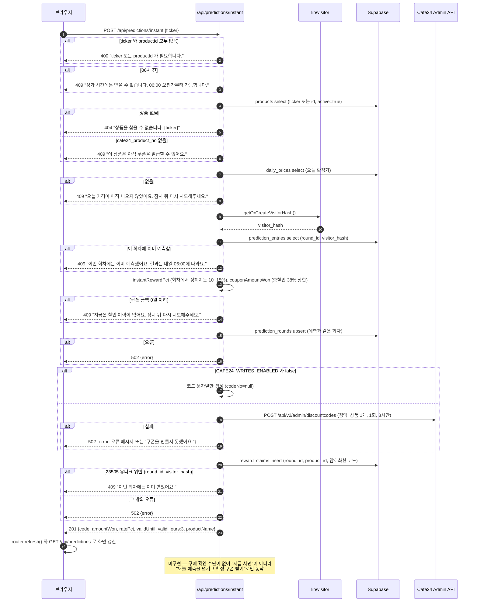

**읽는 법**

- 두 라우트는 서로의 기록을 먼저 조회해 막고, 동시에 들어온 요청은 DB 부분 유니크 인덱스(`prediction_entries`, `reward_claims`의 `(round_id, visitor_hash)`)가 최종으로 막는다.
- 회차 ID는 `{시장 날짜}-am` 하나뿐이다. 오후장(16:00~다음 날 01:59) 제출도 같은 날 회차이고, 판정은 모두 다음 날 06:00 오전가다.
- 바로 받기는 Cafe24 코드를 먼저 만들고 나서 `reward_claims`에 저장한다. 저장 단계에서 23505가 나면 몰에 만든 코드는 DB에 기록되지 않은 채 남는다.
- 적중·무승부(같은 가격) 판정과 예측 보상 코드 발급은 S2의 `resolvePredictions` 구간을 본다.

---

## S7. Cafe24 OAuth 연결과 토큰 자동 갱신

**요약:** 운영자가 한 번 동의하면 토큰을 암호화해 `cafe24_tokens`에 저장하고, 이후 모든 Admin API 호출은 만료 5분 전 자동 갱신과 401 재시도를 거친다.

**근거 코드:** `app/api/auth/cafe24/start/route.ts:GET`, `app/api/auth/cafe24/callback/route.ts:GET`, `lib/cafe24/client.ts:requestToken·save·exchangeCodeForTokens·getAccessToken·cafe24Request·parseCafe24Time`, `lib/crypto.ts:encryptSecret·decryptSecret`

**코드 대조일:** 2026-09-23

### S7-a. 최초 연결

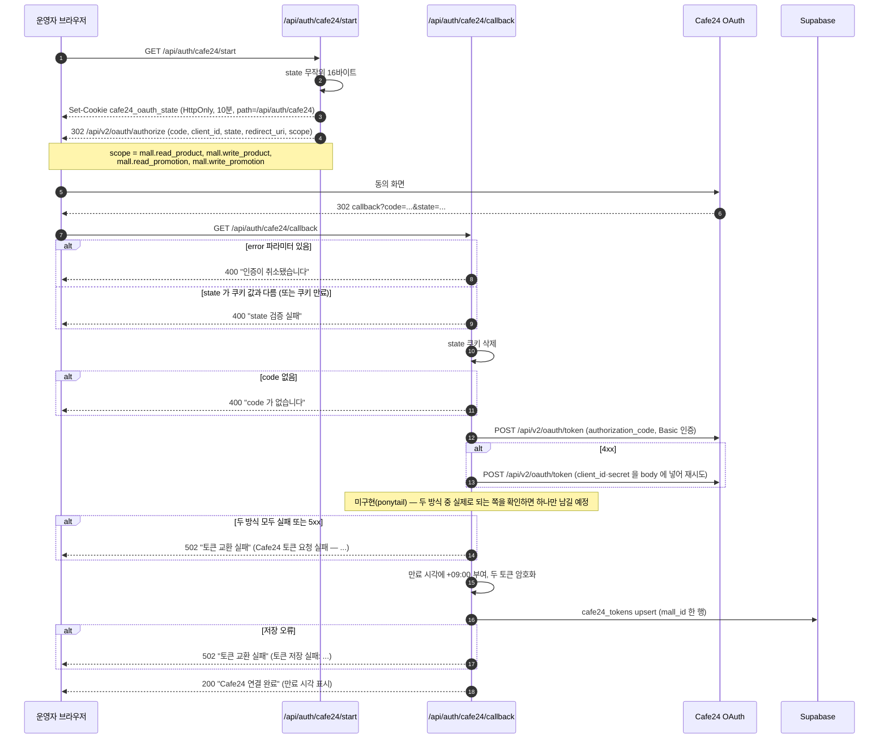

### S7-b. Admin API 호출 때 토큰 자동 갱신 (`cafe24Request`)

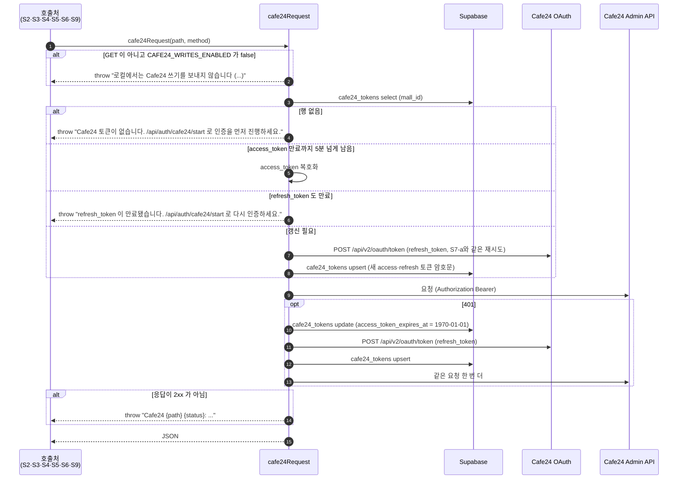

**읽는 법**

- 토큰 원문은 DB에 두지 않고 `*_ciphertext` 컬럼에 암호문으로만 저장한다.
- 갱신 때 refresh_token도 새로 내려오므로 두 토큰을 함께 덮어쓴다.
- 로컬·프리뷰에서 실몰 쓰기를 막는 최종 방어선은 각 호출처가 아니라 `cafe24Request` 첫머리다. `NODE_ENV=production`이거나 `CAFE24_ALLOW_LOCAL_WRITES=1`일 때만 쓰기가 나간다.

---

## S8. 구매 이동 (`/api/out/cafe24/[productId]`)

**요약:** 구매 버튼은 우리 서버를 거쳐 Cafe24 상품 상세로 302 이동한다. 목적지는 서버가 DB·설정 파일로 조립한다.

**근거 코드:** `app/api/out/cafe24/[productId]/route.ts:GET`, `config/cafe24-product-map.json`, `components/bread-market/sheets.tsx`·`MyPanel.tsx`(`window.open`)

**코드 대조일:** 2026-09-23

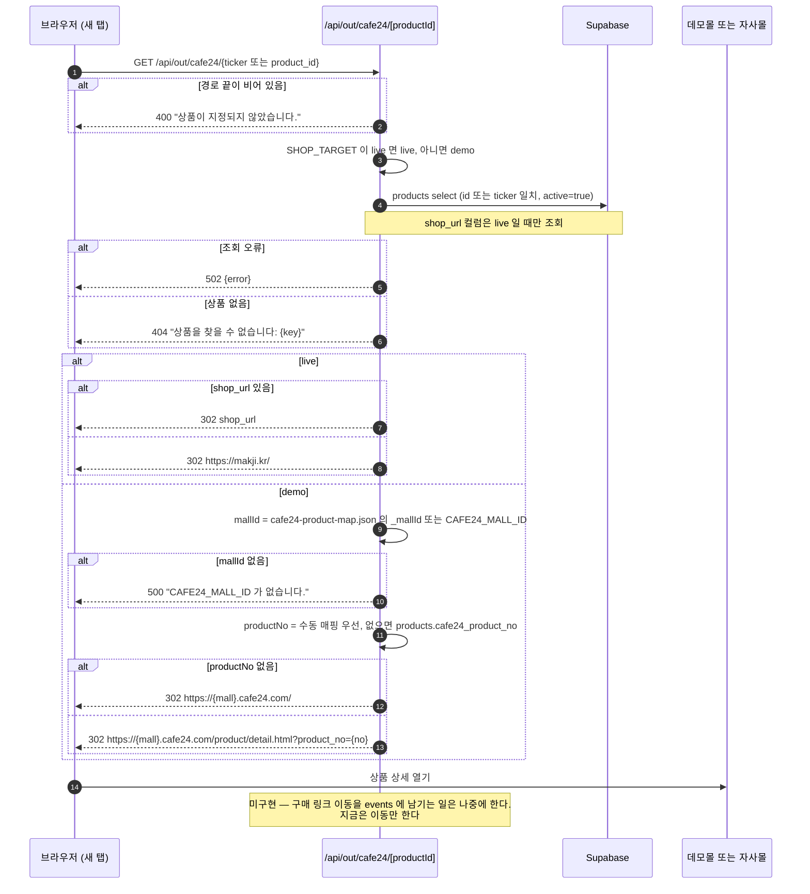

**읽는 법**

- 브라우저가 보낸 URL을 그대로 쓰지 않고 상품 키로 DB를 찾아 목적지를 만들므로, 임의 주소로 보내는 오픈 리다이렉트가 생기지 않는다.
- 데모 모드는 DB 상품번호보다 `config/cafe24-product-map.json` 수동 매핑을 먼저 쓴다. DB 동기화(S9) 전이어도 의도한 샘플 상품으로 간다.
- 방문자 식별·클릭 기록은 하지 않는다. `visitor_token`도 읽지 않는다.

---

## S9. 상품번호 동기화

**요약:** 운영자가 Cafe24 상품 목록을 읽어 `products.cafe24_product_no`를 채운다. GET은 드라이런, POST는 실제 반영이다.

**근거 코드:** `app/api/internal/sync-products/route.ts:GET·POST·buildPlan·normalize`, `config/cafe24-product-map.json`, `lib/cafe24/client.ts:cafe24Request`

**코드 대조일:** 2026-09-23

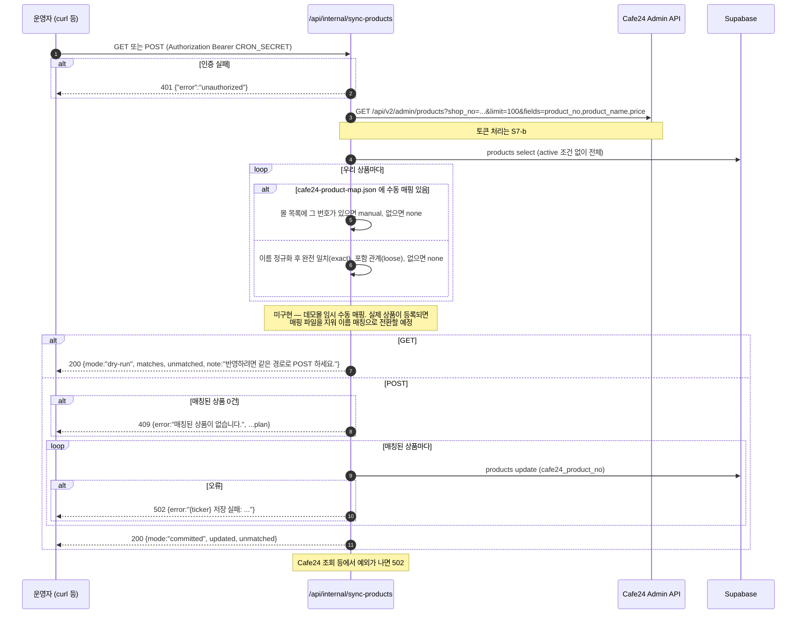

**읽는 법**

- 크론에 등록되지 않은 수동 작업이다. 인증은 크론과 같은 `CRON_SECRET`을 쓴다.
- Cafe24에는 GET만 보낸다. 상품 등록이나 내용 변경은 하지 않는다.
- 몰 상품 목록은 `limit=100` 한 페이지만 읽는다. 100개가 넘는 몰에서는 뒤쪽 상품이 매칭 후보에서 빠진다.
