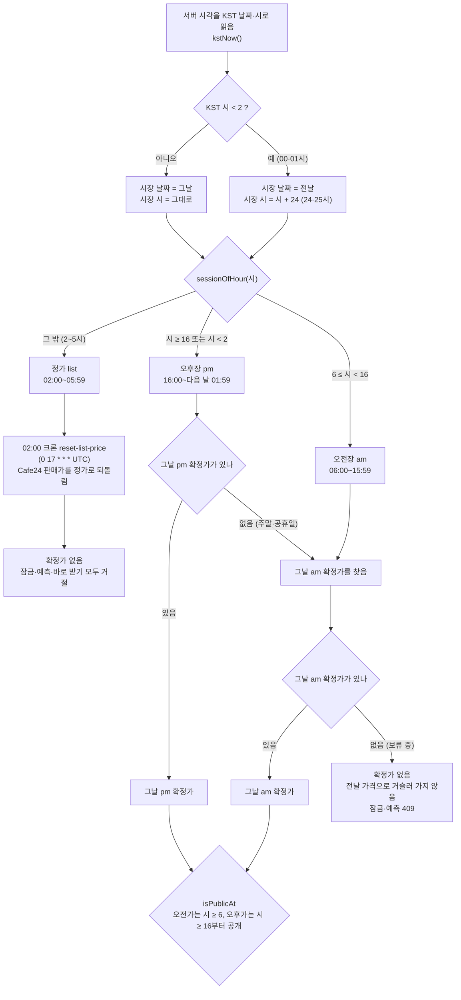
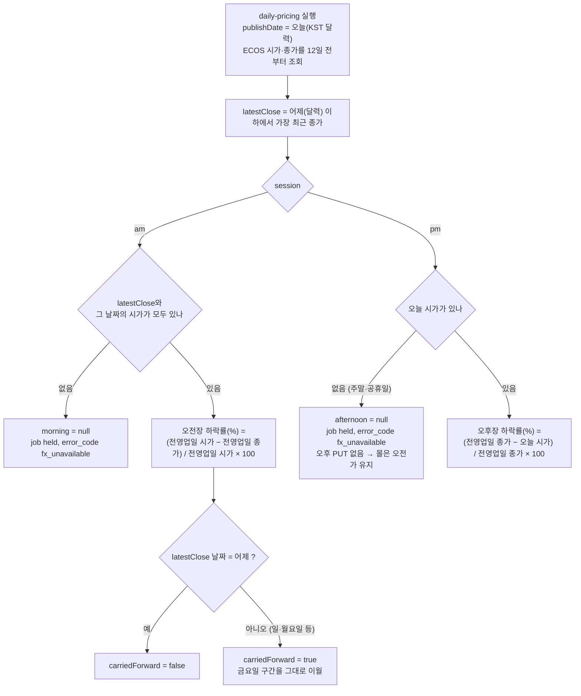
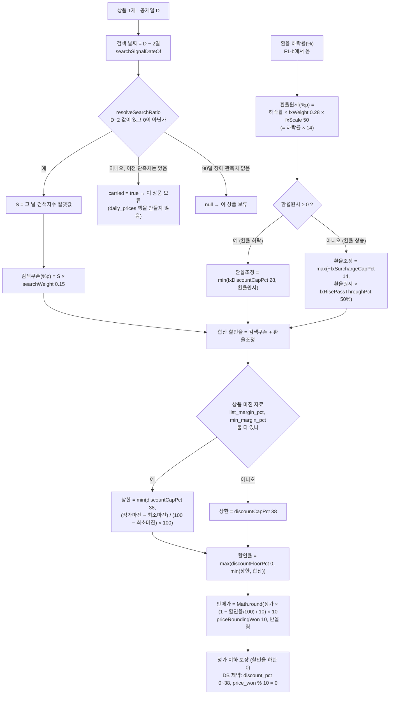
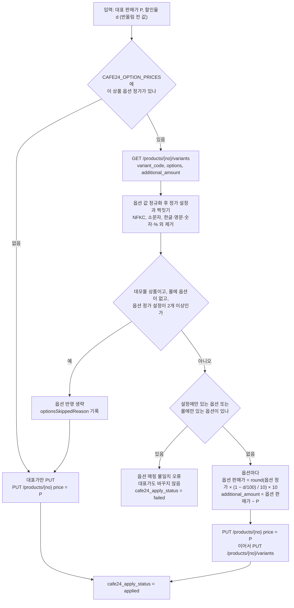
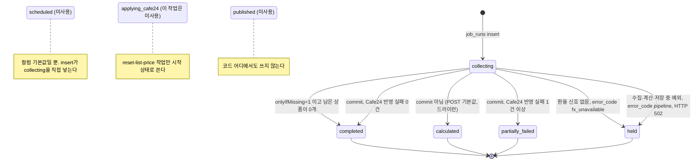
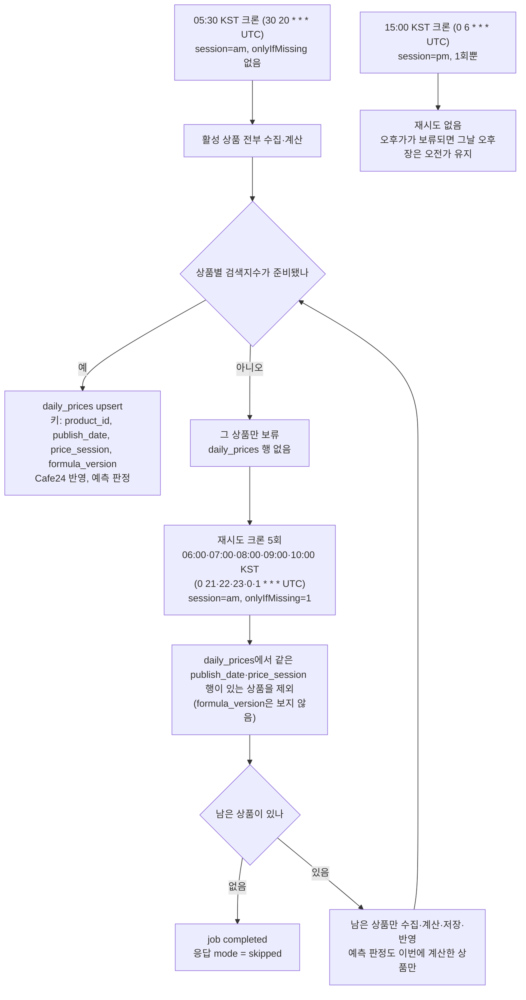
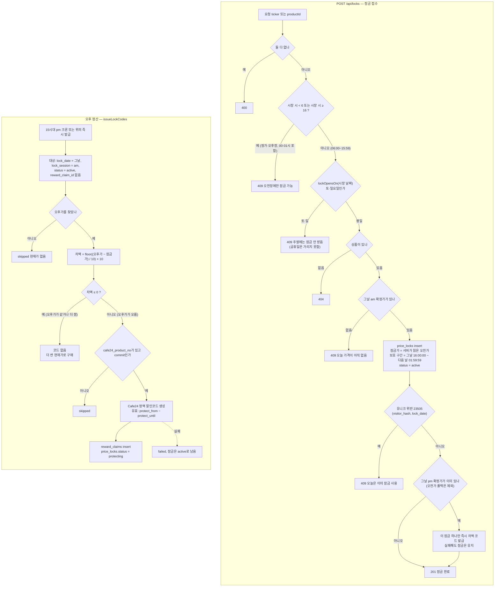
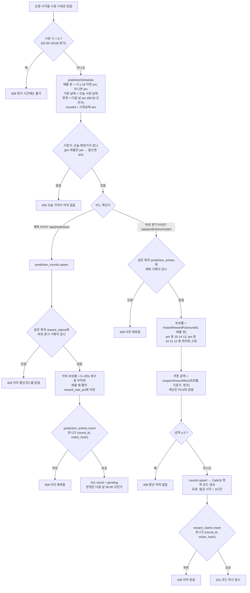
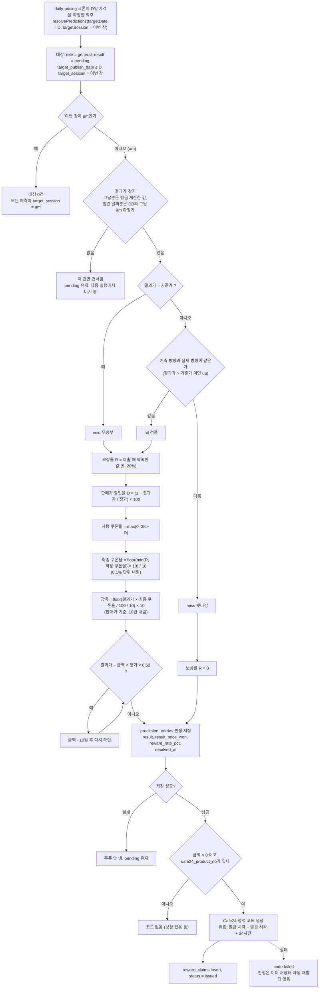

# 핵심 기능별 플로우차트 (F1~F5)

MVP 앱(`prototype-n-development/makji-stock/`)의 판단 규칙을 코드 그대로 옮겼다. 아래 경로는 모두 이 앱 폴더 기준이다.
분기 조건과 숫자는 코드·config에서 그대로 가져왔고, `tests/*.test.mjs`로 경계값을 한 번 더 확인했다.

- 시각은 모두 KST다. 크론 스케줄(`vercel.json`)만 UTC로 적혀 있어 괄호 안에 KST를 함께 적었다.
- "시장 시계"는 02:00에 날짜가 바뀌는 시계다. 00~01시는 전날 날짜의 24·25시로 센다.

| ID | 이름 | 다이어그램 |
|---|---|---|
| F1 | 장 세션 판정 | F1-a 세션과 날짜 경계, F1-b 환율 구간과 주말 이월 |
| F2 | 할인율·판매가 계산 | F2-a 대표 판매가, F2-b 옵션가 `additional_amount` |
| F3 | 가격 산정 작업 상태 전이 | F3-a `job_runs.status`, F3-b `onlyIfMissing` 재시도 |
| F4 | 가격 잠금 가능 여부와 오후 정산 | F4 |
| F5 | 예측 판정과 보상 | F5-a 제출과 바로 받기, F5-b 판정과 쿠폰 발급 |

---

## F1. 장 세션 판정

### F1-a. 세션과 02:00 날짜 경계

지금 시각이 어느 장(정가·오전장·오후장)인지, 그리고 그 장에 어떤 확정가를 보여주고 쓰는지 정한다.

- 근거 코드: `lib/market/calendar.ts` (`marketClockOf`, `kstNow`), `lib/bread-market/reward-policy.ts` (`sessionOfHour`, `isPublicAt`), `lib/pricing/current-price.ts` (`priceSlots`), `lib/predictions/schedule.ts`, `vercel.json`
- 확인한 테스트: `tests/market-calendar.test.mjs`, `tests/reward-policy.test.mjs`, `tests/current-price.test.mjs`
- 코드 대조일: 2026-09-23

읽는 법
- 00:00~01:59는 달력으로는 다음 날이지만 시장 시계로는 전날 24·25시다. 그래서 `sessionOfHour`의 `시 ≥ 16` 조건에 걸려 전날 오후장이 01:59까지 이어진다.
- 확정가는 그날 것만 찾는다. 오후장은 그날 오후가가 없으면 그날 오전가로 내려가고(주말), 그날 오전가도 없으면 가격이 없는 것으로 보고 거절한다.
- 크론은 05시대·15시대에 `daily_prices`를 쓰지만 공개 시각은 `isPublicAt`이 06:00·16:00으로 고정한다.
- 가격 산정 크론이 어느 장을 만들지는 `resolveSession`이 따로 정한다: `?session=` 파라미터 → 크론 헤더의 UTC 시가 6이면 pm, 그 밖은 am → 헤더도 없으면 KST 15~23시는 pm, 나머지는 am (`lib/pricing/daily-job.ts:38-52`).

### F1-b. 환율 구간과 주말 이월

가격 산정 때 오전장·오후장이 각각 어느 환율 구간의 하락률을 쓰는지, 외환시장이 쉬는 날 어떻게 되는지 보여준다.

- 근거 코드: `lib/pricing/pricing.mjs` (`buildSessionFxSignals`, 43~88행), `app/api/internal/daily-pricing/route.ts` (162~193행), `docs/산식-버전.md` (v1.1)
- 확인한 테스트: `tests/pricing-core.test.mjs`
- 코드 대조일: 2026-09-23

읽는 법
- v1.1부터 두 장이 겹치지 않고 이어진다: 전영업일 시가 →(오전장)→ 전영업일 종가 →(오후장)→ 당일 시가. 현재 `formulaVersion`은 `v1.1`이다(`config/pricing-products.json:13`).
- 주말에도 오전가는 나온다. 토요일 오전은 금요일 시가→종가, 일·월요일 오전은 같은 금요일 구간을 이월해 쓴다. 가격은 매번 정가에서 새로 계산하므로 이월해도 할인이 쌓이지 않는다.
- 주말·공휴일 오후에는 당일 시가가 없어 오후가를 만들지 않는다. 화면과 서버는 F1-a의 규칙대로 그날 오전가를 계속 쓴다.

---

## F2. 할인율·판매가 계산

### F2-a. 대표 판매가

검색지수와 환율 하락률로 할인율을 만들고, 상·하한을 적용해 10원 단위 판매가를 낸다.

- 근거 코드: `lib/pricing/pricing.mjs` (`calculateDay` 90~116행, `resolveSearchRatio` 271~282행, `roundTo` 3~5행), `config/pricing-products.json` (2~14행), `lib/pricing/daily-job.ts` (`searchSignalDateOf`, `marginCapPct`), `app/api/internal/daily-pricing/route.ts` (195~225행), `supabase/migrations/005_no_surcharge_reward5.sql`
- 확인한 테스트: `tests/pricing-core.test.mjs`, `tests/search-carry-forward.test.mjs`, `tests/daily-job.test.mjs`
- 코드 대조일: 2026-09-23 · 산식 버전 `v1.1` (계수와 상한은 v1.0과 같고 오전장 환율 구간만 바뀜, `docs/산식-버전.md`)

읽는 법
- 계수는 `config/pricing-products.json` 값이다: `searchWeight 0.15`, `fxWeight 0.28`, `fxScale 50`, `fxDiscountCapPct 28`, `fxSurchargeCapPct 14`, `fxRisePassThroughPct 50`, `discountCapPct 38`, `discountFloorPct 0`, `priceRoundingWon 10`. `dailyPriceMoveCapPct`는 `null`이고 운영 경로(`calculateDay`)는 이 값을 쓰지 않는다.
- 환율이 내리면 ×14를 전부 할인에 더하고(최대 +28%p), 오르면 ×7만 할인에서 뺀다(최대 −14%p). 테스트 예: S=60, 환율 0.5% 하락 → 16.00%, 0.5% 상승 → 5.50% (`tests/pricing-core.test.mjs:136-149`).
- 할인율 하한이 0이라 판매가는 정가를 넘지 않는다. 상한 38%이면 판매가는 정가의 62%까지 내려간다. 마진 자료가 있는 상품은 상한이 38보다 작아질 수 있다.
- 검색지수가 D−2에 없어 이월값밖에 없으면 계산하지 않고 그 상품만 보류한다. 보류된 상품은 F3-b의 재시도가 다시 만든다.

### F2-b. 옵션가와 `additional_amount`

대표 판매가를 정한 뒤, Cafe24 옵션마다 구매자가 보는 옵션 총액을 같은 할인율로 계산하고 대표가와의 차이를 추가금으로 보낸다.

- 근거 코드: `lib/pricing/variant-pricing.ts` (`discountedOptionPrice`, `buildVariantPricePlan`, `assertCompleteVariantPricePlan`, `variantUpdateRequestBody`), `config/cafe24-option-prices.ts`, `lib/cafe24/price-sync.ts` (`syncCafe24ProductPrice`)
- 확인한 테스트: `tests/variant-pricing.test.mjs`
- 코드 대조일: 2026-09-23

읽는 법
- 추가금에 할인율을 곱하지 않는다. 옵션 총액(예: 모닝롤 3개 12,200원)에 할인율을 먼저 적용한 뒤 대표 판매가를 빼서 추가금을 만든다. 그래야 세트 옵션의 원래 가격 구성이 유지된다.
- 옵션 판매가도 10원 단위 반올림이다. 테스트 예: 13,700원 × 15% 할인 → 11,650원, 25,900원 × 17.35% 할인 → 21,410원.
- 매핑이 어긋나면 대표가를 PUT하기 전에 멈춘다. 옵션 일부만 옛 가격으로 남은 채 공개되는 일을 막기 위해서다.

---

## F3. 가격 산정 작업 상태 전이

### F3-a. `job_runs.status` (`price_status` enum)

`/api/internal/daily-pricing` 한 번의 실행이 `job_runs` 행에 실제로 남기는 상태만 그렸다.

- 근거 코드: `app/api/internal/daily-pricing/route.ts` (95~117행 시작·실패, 132~149행 `onlyIfMissing`, 175~193행 환율 없음, 378~388행 종료), `supabase/schema.sql:17` (`price_status` enum), `app/api/internal/reset-list-price/route.ts:63`
- 확인한 테스트: 상태 전이 자체를 고정하는 테스트는 없다. 판단 함수만 `tests/cron-session.test.mjs`, `tests/daily-job.test.mjs`가 고정한다.
- 코드 대조일: 2026-09-23

읽는 법
- 상태는 한 번에 최종값으로 바뀐다. `collecting`으로 만든 행을 끝에서 `completed`·`partially_failed`·`calculated`·`held` 중 하나로 한 번만 갱신한다. 중간 단계(계산 완료, Cafe24 반영 중)를 따로 기록하지 않는다.
- `calculated`는 중간 단계가 아니라 "드라이런으로 끝남"이라는 최종값이다. Vercel 크론은 GET이라 `commit` 기본값이 켜져 있다.
- 상품 단위 보류(검색지수 미도착)는 작업 상태를 바꾸지 않는다. 일부 상품이 빠져도 Cafe24 실패가 없으면 `completed`다. 빠진 상품은 F3-b 재시도가 채운다.
- `partially_failed`는 Cafe24 반영 실패만 센다. 잠금 코드·예측 쿠폰 발급 실패는 `step_log`에만 남고 상태에는 반영되지 않는다.

### F3-b. `onlyIfMissing` 재시도

오전가가 보류된 상품을 뒤늦게 만드는 따라잡기 실행의 흐름이다.

- 근거 코드: `vercel.json`, `app/api/internal/daily-pricing/route.ts` (130~149행, 293~296행), `lib/pricing/daily-job.ts` (`resolveSession`), `lib/predictions/resolve.ts`
- 확인한 테스트: `tests/cron-schedule.test.mjs`, `tests/cron-session.test.mjs`
- 코드 대조일: 2026-09-23

읽는 법
- 이미 확정가가 있는 상품은 다시 계산하지 않는다. 공개된 값을 나중 실행이 덮어쓰면 화면에 떴던 가격과 달라지기 때문이다.
- Hobby 크론은 지정한 시간대 안 아무 분에나 돌기 때문에(최대 59분 늦음) 재시도 시각도 "그 시간대"로 읽는다.
- 재시도 실행에서 예측 판정은 이번에 계산한 상품만 본다. 앞선 실행에서 판정이 저장되지 못한 건은 `pending`으로 남아 다음 날 오전 크론이 DB 확정가로 따라잡는다(F5-b).

---

## F4. 가격 잠금 가능 여부와 오후 정산

손님이 오전가를 잠글 수 있는지 판단하고, 오후가가 나오면 차액 할인코드를 발급한다.

- 근거 코드: `app/api/locks/route.ts` (57~164행), `lib/locks/lock-codes.ts` (`issueLockCodes`), `lib/bread-market/reward-policy.ts` (`lockOpensOn`, `lockProtection`, `lockAppliedPriceWon`, `lockCodeAmountWon`), `lib/pricing/current-price.ts`, `app/api/internal/daily-pricing/route.ts` (356~366행), `supabase/schema.sql:173`
- 확인한 테스트: `tests/reward-policy.test.mjs` (잠금 세션, 평일, 차액), `tests/current-price.test.mjs`
- 코드 대조일: 2026-09-23

읽는 법
- 잠금은 평일 오전장(06:00~15:59)에 하루 한 번, 빵 한 개만 된다. 하루 한 번은 앱이 아니라 DB 유니크 제약 `(visitor_hash, lock_date)`가 막는다.
- 적용가는 `min(잠금가, 현재가)`다. 오후가가 오르면 차액만큼 정액 코드를 주고, 내리거나 같으면 코드 없이 더 싼 현재가로 산다. 몰 판매가 자체는 오후가 그대로다.
- 크론이 15시대 어느 분에 돌지 모르므로, 크론 뒤 15:59까지 걸린 잠금은 접수하는 자리에서 바로 발급한다. `reward_claim_id`가 빈 잠금만 보므로 둘이 겹쳐도 두 번 나가지 않는다.
- 발급이 실패한 잠금은 `active`로 남지만, 그날 오후 크론은 한 번뿐이라 자동으로 다시 발급되지 않는다.

---

## F5. 예측 판정과 보상

### F5-a. 예측 제출(공격형)과 바로 받기(안정형)

한 시장 날짜에 방문자는 예측과 바로 받기 중 하나만 할 수 있다. 둘 다 다음 날 06:00 오전가 회차를 쓴다.

- 근거 코드: `app/api/predictions/route.ts` (49~159행), `app/api/predictions/instant/route.ts` (25~151행), `lib/predictions/schedule.ts`, `lib/bread-market/reward-policy.ts` (`instantRewardPct`, `rollPredictionRewardPct`, `INSTANT_CODE_HOURS`), `supabase/schema.sql:214`, `supabase/migrations/006_prediction_risk_reward.sql:24`
- 확인한 테스트: `tests/prediction-schedule.test.mjs`, `tests/reward-policy.test.mjs` (안정형·공격형 보상률)
- 코드 대조일: 2026-09-23

읽는 법
- 판정은 제출 시각과 상관없이 늘 다음 날 06:00 오전가다. 오전에 내든 자정 넘어(시장 시계 24·25시) 내든 같다. 주말에도 쉬지 않는다.
- 회차 id가 `시장날짜-am` 하나라 오전장·오후장 제출이 같은 회차를 쓴다. 즉 시장 날짜 하루에 예측이나 바로 받기 중 한 번이다.
- 상호 배제는 각 라우트가 상대 테이블을 먼저 조회해서 막는다. DB 유니크 제약은 테이블마다 따로 걸려 있어(`prediction_entries`, `reward_claims`), 두 요청이 동시에 들어오는 경우까지 DB가 막아 주지는 않는다.
- 바로 받기는 상품에 `cafe24_product_no`가 없으면 409로 거절한다(흐름에서는 생략).

### F5-b. 판정과 쿠폰 발급 (38% 상한에 따른 쿠폰율 축소)

오전가가 확정되는 가격 산정 크론 안에서 밀린 예측까지 판정하고 할인코드를 낸다.

- 근거 코드: `lib/predictions/resolve.ts` (59~183행), `lib/bread-market/reward-policy.ts` (`resolveDirection` 174~178행, `rewardPctFor` 123~125행, `finalCouponPct` 141~144행, `couponAmountWon` 161~167행, `predictionCodeValidUntil` 213~215행), `app/api/internal/daily-pricing/route.ts` (368~376행)
- 확인한 테스트: `tests/reward-policy.test.mjs`, `tests/prediction.test.mjs`
- 코드 대조일: 2026-09-23

읽는 법
- 모든 예측이 다음 날 오전가로 판정되므로 실제 판정은 오전 크론(05시대와 재시도)에서만 일어난다. 오후 크론도 같은 함수를 부르지만 대상이 없다.
- 동가는 `void`이고, 빗나감(`miss`)만 0%다. 무승부에도 제출 때 약속한 보상률을 그대로 준다.
- 쿠폰은 판매가에 보상률을 곱하되, 상품 할인과 합쳐 정가의 38%를 넘지 않게 쿠폰율을 `38 − D`로 자르고 결제가가 정가의 62% 아래로 내려가면 10원씩 더 줄인다. 테스트 예: 판매가 6,500원·정가 10,000원(D 35%)에서 5% → 3%로 줄어 190원.
- 코드 유효기간은 공격형(예측) 24시간, 안정형(바로 받기) 3시간, 잠금 차액 코드는 보호 구간(16:00~다음 날 01:59:59)이다. 셋 다 발급 시각 또는 잠금 구간 기준이고, 시장일 기준이 아니다.
