# 05. 미구현 기능 설계안 (F-A1~F-A12)

> 이 문서는 **미구현 설계안**이다. 현행 동작은 01~04를 본다.
> 여기 그린 라우트·테이블·컬럼 중 "(신규)"라고 붙인 것은 아직 코드와 스키마에 없다.

- 대상: MVP 앱 `prototype-n-development/makji-stock/`. 코드 경로는 모두 이 폴더 기준이고, `docs/`·`research/`는 저장소 루트 기준이다.
- 범위: `docs/PRD-브레드마켓.md`에 **정해져 있지만 아직 구현하지 않은** 기능만 그렸다. 문서가 값이나 방식을 정하지 않은 곳은 지어내지 않고 "미정"으로 적었고, 파일 끝 [미정으로 남긴 값](#미정으로-남긴-값)에 모았다.
- PRD 행 번호: 2026-09-23 현재 `docs/PRD-브레드마켓.md` 기준이다. 행이 밀리면 § 번호로 찾는다.
- 표기: 참여자 이름(`B` 브라우저, `R` 라우트, `V` lib/visitor, `SB` Supabase, `C24` Cafe24 Admin API, `CR` Vercel Cron)과 테이블·컬럼 이름은 [03](03-sequences.md)·[02](02-erd.md)를 그대로 따른다. 운영자 알림처럼 문서에 구현 수단이 없는 것은 추상 참여자로 그렸다.
- 작성일: 2026-09-23

**그리지 않은 것 (2026-09-23 결정):**
- **폐기:** 이메일 인증·발송(`price_lock_verified`, `reward_email_verified`, `notification_deliveries`). 본인 확인은 쿠키, 쿠폰 전달은 MY 화면이 정본이다.
- **보류:** 주문 연동과 구매 귀속(`purchase_completed`, `purchase_attributions`, `/api/internal/cafe24/orders`), 구매자 예측(`role=buyer`), 오후 잠금(`lock_session=pm`).

| ID | 기능 | 다이어그램 | 선결 조건 |
|---|---|---|---|
| F-A1 | 행동 이벤트 수집 `POST /api/events` | F-A1-a 시퀀스(브라우저 이벤트), F-A1-b 시퀀스(서버 이벤트), 수집 이벤트 표 | F-A3(세션), F-A7(요청 보호) |
| F-A2 | 구매 링크 클릭 기록 | F-A2 시퀀스 (S8 확장) | F-A1 |
| F-A3 | 분석 동의·최초 UTM·`visitor_sessions` | F-A3-a ERD, F-A3-b 플로우차트 | F-A12(동의 화면) |
| F-A4 | 공개 잠금 현황 집계 | F-A4 시퀀스 | 없음 |
| F-A5 | 가격 잠금 해지 | F-A5-a 상태 전이, F-A5-b 시퀀스 | 없음 |
| F-A6 | 운영자 실패 알림 | F-A6 시퀀스 (S2·S3·S4·S7-b 실패 분기) | 알림 채널 결정 |
| F-A7 | 속도 제한·CSRF 방어 | F-A7 아키텍처 flowchart | 저장소·방식 결정 |
| F-A8 | 예측 판정 정정 기록 | F-A8 플로우차트 | 정정 실행 절차 결정 |
| F-A9 | 할인코드 사용 추적 | F-A9 시퀀스 | Cafe24 주문 조회 scope |
| F-A10 | 기준가·상품번호 변경 이력 | F-A10-a ERD, F-A10-b 시퀀스 | 운영자 변경 경로 결정 |
| F-A11 | Cafe24 가격 반영 감사 로그 | F-A11-a ERD, F-A11-b 시퀀스 (S2 PUT 구간) | 없음 |
| F-A12 | 개인정보 처리방침·쿠키 안내 | F-A12 플로우차트 (F-A3 동의와 연결) | 처리방침 내용 확정 |

---

## F-A1. 행동 이벤트 수집 (`POST /api/events`)

**한 줄 요약:** 브라우저 이벤트는 `POST /api/events`(신규)가 검증한 뒤 `events`에 저장하고, 서버 이벤트는 저장에 성공한 라우트가 직접 `events`에 남긴다. 이벤트 UUID를 기본 키로 써서 재전송해도 한 번만 저장된다.

- 근거: PRD §16.11(764-777), §19(924-926), §21.1(955-975), §21.2(983-1003), §22.2(1044-1045), §23 출시 기준(1095-1097), `supabase/schema.sql` `events` 주석(252-253행)
- 현행 코드 연결: 테이블 `events`는 이미 있고 쓰는 코드가 없다([E2](02-erd.md#e2-이벤트-데이터-erd-마케팅분석용)). 신규 라우트 `app/api/events/route.ts`, 쿠키 해시는 `lib/visitor.ts`의 `readVisitorHash`, 브라우저 쪽 전송은 `components/bread-market/Shell.tsx`의 `BreadMarketShell`
- 상태: 설계안(미구현)
- 선결 조건: F-A3의 `visitor_sessions`(없으면 `session_id`는 null로 저장), F-A7의 요청 보호 단계

### F-A1-a. 브라우저 이벤트

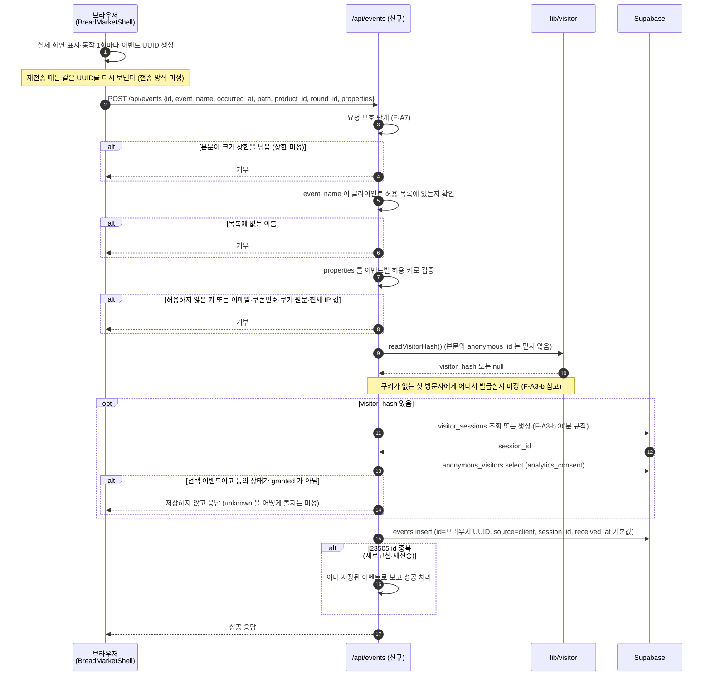
```mermaid
sequenceDiagram
    autonumber
    participant B as 브라우저<br/>(BreadMarketShell)
    participant R as /api/events (신규)
    participant V as lib/visitor
    participant SB as Supabase

    B->>B: 실제 화면 표시·동작 1회마다 이벤트 UUID 생성
    Note over B: 재전송 때는 같은 UUID를 다시 보낸다 (전송 방식 미정)
    B->>R: POST /api/events {id, event_name, occurred_at, path, product_id, round_id, properties}
    R->>R: 요청 보호 단계 (F-A7)
    alt 본문이 크기 상한을 넘음 (상한 미정)
        R-->>B: 거부
    end
    R->>R: event_name 이 클라이언트 허용 목록에 있는지 확인
    alt 목록에 없는 이름
        R-->>B: 거부
    end
    R->>R: properties 를 이벤트별 허용 키로 검증
    alt 허용하지 않은 키 또는 이메일·쿠폰번호·쿠키 원문·전체 IP 값
        R-->>B: 거부
    end
    R->>V: readVisitorHash() (본문의 anonymous_id 는 믿지 않음)
    V-->>R: visitor_hash 또는 null
    Note over R,V: 쿠키가 없는 첫 방문자에게 어디서 발급할지 미정 (F-A3-b 참고)
    opt visitor_hash 있음
        R->>SB: visitor_sessions 조회 또는 생성 (F-A3-b 30분 규칙)
        SB-->>R: session_id
        R->>SB: anonymous_visitors select (analytics_consent)
        alt 선택 이벤트이고 동의 상태가 granted 가 아님
            R-->>B: 저장하지 않고 응답 (unknown 을 어떻게 볼지는 미정)
        end
    end
    R->>SB: events insert (id=브라우저 UUID, source=client, session_id, received_at 기본값)
    alt 23505 id 중복 (새로고침·재전송)
        R->>R: 이미 저장된 이벤트로 보고 성공 처리
    end
    R-->>B: 성공 응답
```

### F-A1-b. 서버 이벤트 (`prediction_submit` 예시)

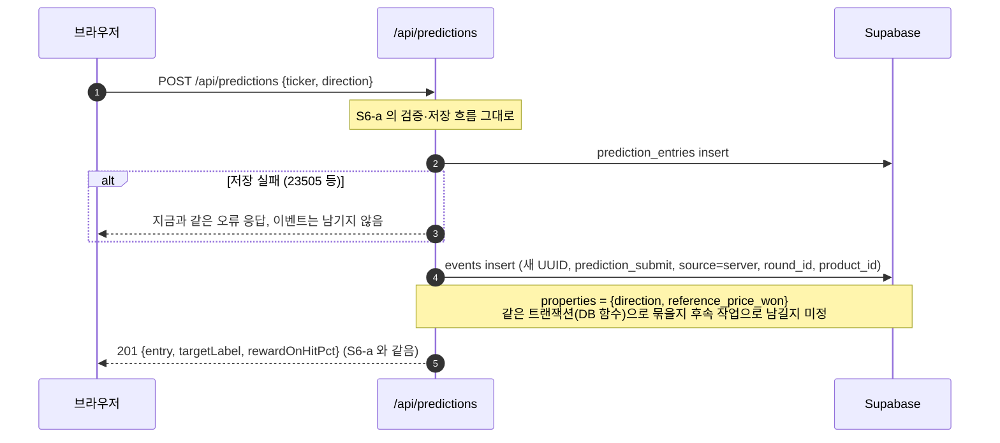
```mermaid
sequenceDiagram
    autonumber
    participant B as 브라우저
    participant R as /api/predictions
    participant SB as Supabase

    B->>R: POST /api/predictions {ticker, direction}
    Note over R: S6-a 의 검증·저장 흐름 그대로
    R->>SB: prediction_entries insert
    alt 저장 실패 (23505 등)
        R-->>B: 지금과 같은 오류 응답, 이벤트는 남기지 않음
    end
    R->>SB: events insert (새 UUID, prediction_submit, source=server, round_id, product_id)
    Note over R,SB: properties = {direction, reference_price_won}<br/>같은 트랜잭션(DB 함수)으로 묶을지 후속 작업으로 남길지 미정
    R-->>B: 201 {entry, targetLabel, rewardOnHitPct} (S6-a 와 같음)
```

### 수집 이벤트 목록

`source` 열에서 PRD §21.2에 직접 적힌 것은 `page_view`(client)·`prediction_submit`(server)·`purchase_link_click`(server)이다. 나머지는 PRD §21.1의 발생 시점이 브라우저 동작인지, 서버 저장 성공인지로 나눴다.

| 이벤트 | source | 기록하는 곳 (현행 코드 연결 지점) | properties (PRD §21.1 주요 속성) | 이 설계에서 |
|---|---|---|---|---|
| `page_view` | client | `Shell.tsx` `BreadMarketShell` 화면 표시 때 | `path`, UTM, referrer 도메인 | 수집 |
| `product_click` | client | `sheets.tsx` `DetailSheet`를 여는 상품 카드 클릭 (`MarketPanel.tsx`) | `product_id`, `placement` | 수집 |
| `price_lock_start` | client | `sheets.tsx` `LockSheet` 열림 | `product_id` | 수집 |
| `result_view` | client | `MyPanel.tsx` `MyPanel`에서 예측 결과 표시 | `round_id`, `result` | 수집 |
| `price_lock_created` | server | `app/api/locks/route.ts` `POST`, `price_locks` insert 성공 뒤 | `product_id`, 잠금가 구간 (구간 폭 미정) | 수집 |
| `price_lock_resolved` | server | `lib/locks/lock-codes.ts` `issueLockCodes`, 잠금가·오후가 비교 뒤 | `product_id`, `lock_session`, `outcome` | 수집 |
| `prediction_submit` | server | `app/api/predictions/route.ts` `POST`, `prediction_entries` insert 성공 뒤 | `round_id`, `product_id`, `direction`, `reference_price_won` | 수집 |
| `purchase_link_click` | server | `app/api/out/cafe24/[productId]/route.ts` `GET` (F-A2) | `product_id`, `click_id` | 수집 |
| `reward_claim_failed` | server | `lib/predictions/resolve.ts` `resolvePredictions`의 `code: "failed"` 분기 | `round_id`, `reason_code` | 수집 |
| `coupon_click` | client | 없음. 지금은 버튼 없이 코드가 ME에 바로 뜬다 | `round_id`, `product_id` | 버튼이 생길 때까지 수집 안 함 |
| `lock_code_sent`, `reward_coupon_sent` | server | — | — | 미정. "발송"이 이메일 발송을 전제로 해 지금의 발급과 같은 뜻인지 정해지지 않았다 |
| `price_lock_verified`, `reward_email_verified` | — | — | — | 범위 밖(미정): 이메일 인증 |
| `purchase_completed` | cafe24 | — | — | 범위 밖(미정): 주문 연동 |
| (PRD에 없음) 바로 받기 | — | `app/api/predictions/instant/route.ts` | — | 이벤트 이름 미정 |

**읽는 법**

- 브라우저가 보내도 되는 이름은 client 줄뿐이다. server 이벤트 이름이 `/api/events`로 들어오면 허용 목록에서 거부한다. 서버 이벤트는 라우트가 저장 성공 뒤에만 남기므로 "예측 저장 성공 = `prediction_submit` 1건"이 맞아떨어진다(PRD 1097).
- 멱등은 `events.id` 기본 키가 맡는다. 같은 UUID가 다시 오면 23505가 나고, 이를 오류가 아니라 이미 받은 것으로 처리한다. 서로 다른 화면 표시는 UUID가 달라 따로 센다(PRD 1003).
- `visitor_hash`는 언제나 서버가 쿠키로 계산한다. 이벤트를 쿠키 없이 받으면 `visitor_hash`·`session_id`가 null인 행이 된다(FK는 null 허용).
- 어떤 이벤트가 동의가 필요한 "선택 이벤트"인지는 PRD가 정하지 않았다(미정). 분류가 정해지면 허용 목록에 함께 적는다.

---

## F-A2. 구매 링크 클릭 기록 (S8 확장)

**한 줄 요약:** 구매 이동 라우트가 상품을 찾은 뒤 `click_id`를 만들어 `purchase_link_click`을 `events`에 저장하고, 그다음 지금처럼 302로 보낸다.

- 근거: PRD §16.12 설명(789), §21.1(970), §21.2(993-996), §23 출시 기준(1098)
- 현행 코드 연결: `app/api/out/cafe24/[productId]/route.ts` `GET` — 상품 조회(`maybeSingle`)와 첫 `Response.redirect` 사이. 파일 머리 주석(6~8행)이 "나중에 구매 링크 이동을 events 에 남겨야" 한다고 적어 두었다. 현행 흐름은 [S8](03-sequences.md#s8-구매-이동-apioutcafe24productid)
- 상태: 설계안(미구현)
- 선결 조건: F-A1(이벤트 저장 규칙). `click_id`를 Cafe24 주문과 잇는 일은 주문 연동이라 범위 밖(미정)

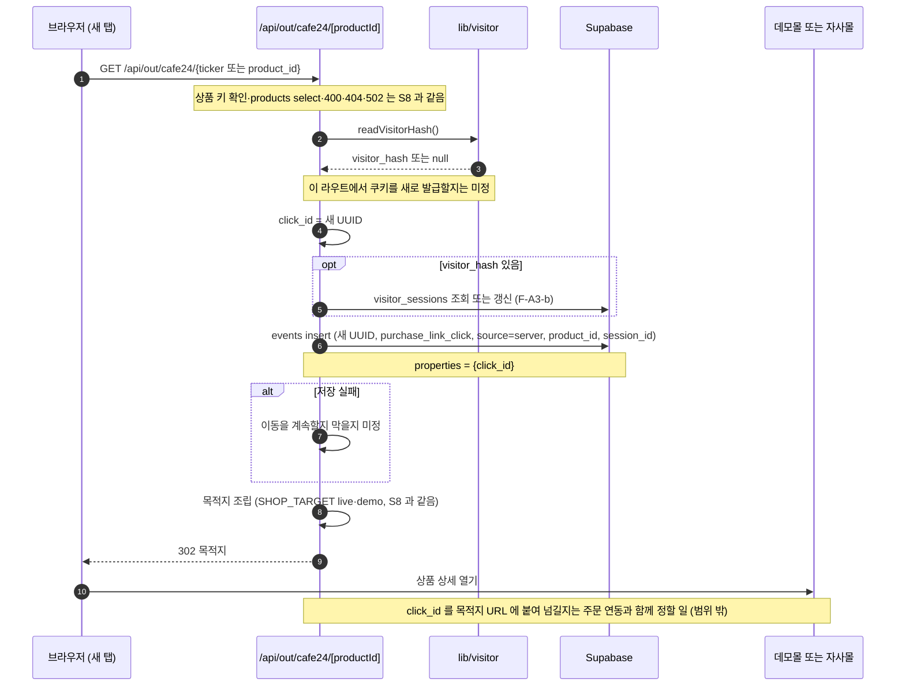
```mermaid
sequenceDiagram
    autonumber
    participant B as 브라우저 (새 탭)
    participant R as /api/out/cafe24/[productId]
    participant V as lib/visitor
    participant SB as Supabase
    participant M as 데모몰 또는 자사몰

    B->>R: GET /api/out/cafe24/{ticker 또는 product_id}
    Note over R: 상품 키 확인·products select·400·404·502 는 S8 과 같음
    R->>V: readVisitorHash()
    V-->>R: visitor_hash 또는 null
    Note over R,V: 이 라우트에서 쿠키를 새로 발급할지는 미정
    R->>R: click_id = 새 UUID
    opt visitor_hash 있음
        R->>SB: visitor_sessions 조회 또는 갱신 (F-A3-b)
    end
    R->>SB: events insert (새 UUID, purchase_link_click, source=server, product_id, session_id)
    Note over R,SB: properties = {click_id}
    alt 저장 실패
        R->>R: 이동을 계속할지 막을지 미정
    end
    R->>R: 목적지 조립 (SHOP_TARGET live·demo, S8 과 같음)
    R-->>B: 302 목적지
    B->>M: 상품 상세 열기
    Note over R,M: click_id 를 목적지 URL 에 붙여 넘길지는 주문 연동과 함께 정할 일 (범위 밖)
```

**읽는 법**

- 목적지를 만드는 방식은 그대로다. 사이에 이벤트 저장 한 번이 끼어들 뿐이다. 서버가 상품을 찾은 뒤에만 기록하므로 없는 상품 키로는 이벤트가 생기지 않는다.
- `click_id`는 `events.properties`에 담는다. PRD §16.12 `purchase_attributions`에도 `click_id`가 있지만 그 테이블은 주문 연동 단계에서 만든다(`schema.sql` 머리 주석).
- 퍼널 4단계 "Cafe24 이동률"은 이 이벤트로 확정 지표가 된다. 주문 연결이 없으므로 구매 전환율은 확정값으로 보여주지 않는다(PRD 789, 1021).

---

## F-A3. 방문자 분석 동의·최초 UTM·`visitor_sessions`

**한 줄 요약:** `anonymous_visitors`의 비어 있던 동의·UTM 컬럼을 채우고, `visitor_sessions`(신규)로 30분 규칙에 따라 방문을 세션으로 나눈다. `events.session_id`는 이 테이블을 가리키게 된다.

- 근거: PRD §16.9(743-751), §16.10(753-762), §21.4(1024-1028), §22.2(1044-1045), `supabase/schema.sql` 머리 주석(`visitor_sessions`는 "분석 심화 단계에서 추가")
- 현행 코드 연결: `lib/visitor.ts`의 `getOrCreateVisitorHash`(지금은 `last_seen_at`만 upsert), `readVisitorHash`. 세션 계산은 F-A1의 `/api/events`와 F-A2의 구매 이동 라우트에서 부른다
- 상태: 설계안(미구현)
- 선결 조건: F-A12 동의 화면(동의 값을 받을 곳), `visitor_sessions` migration(번호는 구현 때 정함)

### F-A3-a. 추가 테이블·컬럼 ERD

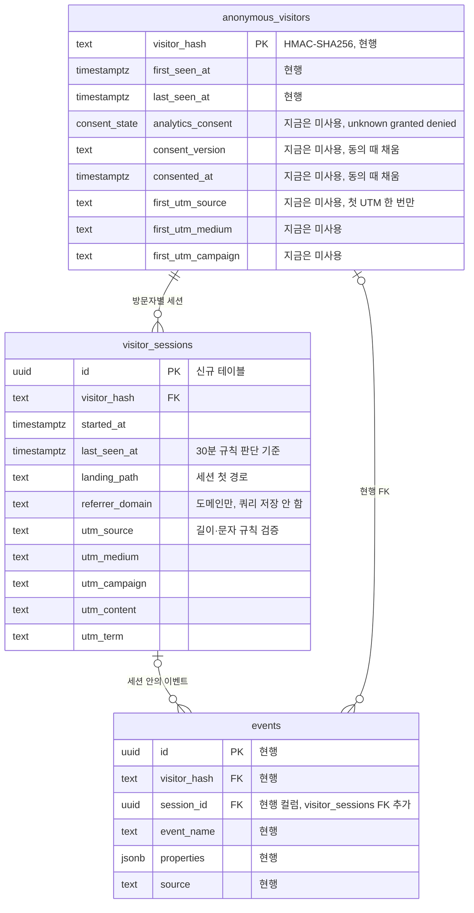
```mermaid
erDiagram
    anonymous_visitors {
        text visitor_hash PK "HMAC-SHA256, 현행"
        timestamptz first_seen_at "현행"
        timestamptz last_seen_at "현행"
        consent_state analytics_consent "지금은 미사용, unknown granted denied"
        text consent_version "지금은 미사용, 동의 때 채움"
        timestamptz consented_at "지금은 미사용, 동의 때 채움"
        text first_utm_source "지금은 미사용, 첫 UTM 한 번만"
        text first_utm_medium "지금은 미사용"
        text first_utm_campaign "지금은 미사용"
    }
    visitor_sessions {
        uuid id PK "신규 테이블"
        text visitor_hash FK
        timestamptz started_at
        timestamptz last_seen_at "30분 규칙 판단 기준"
        text landing_path "세션 첫 경로"
        text referrer_domain "도메인만, 쿼리 저장 안 함"
        text utm_source "길이·문자 규칙 검증"
        text utm_medium
        text utm_campaign
        text utm_content
        text utm_term
    }
    events {
        uuid id PK "현행"
        text visitor_hash FK "현행"
        uuid session_id FK "현행 컬럼, visitor_sessions FK 추가"
        text event_name "현행"
        jsonb properties "현행"
        text source "현행"
    }

    anonymous_visitors ||--o{ visitor_sessions : "방문자별 세션"
    visitor_sessions |o--o{ events : "세션 안의 이벤트"
    anonymous_visitors |o--o{ events : "현행 FK"
```

### F-A3-b. 세션 분리와 동의 분기

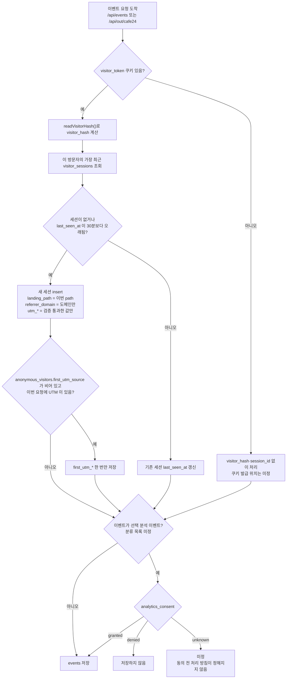
```mermaid
flowchart TD
    A["이벤트 요청 도착<br/>/api/events 또는 /api/out/cafe24"] --> B{"visitor_token 쿠키 있음?"}
    B -->|"아니오"| B1["visitor_hash·session_id 없이 처리<br/>쿠키 발급 위치는 미정"]
    B -->|"예"| C["readVisitorHash()로 visitor_hash 계산"]
    C --> D["이 방문자의 가장 최근 visitor_sessions 조회"]
    D --> E{"세션이 없거나<br/>last_seen_at 이 30분보다 오래됨?"}
    E -->|"예"| F["새 세션 insert<br/>landing_path = 이번 path<br/>referrer_domain = 도메인만<br/>utm_* = 검증 통과한 값만"]
    E -->|"아니오"| G["기존 세션 last_seen_at 갱신"]
    F --> H{"anonymous_visitors.first_utm_source 가 비어 있고<br/>이번 요청에 UTM 이 있음?"}
    H -->|"예"| H1["first_utm_* 한 번만 저장"]
    H -->|"아니오"| I
    H1 --> I
    G --> I{"이벤트가 선택 분석 이벤트?<br/>분류 목록 미정"}
    I -->|"아니오"| S["events 저장"]
    I -->|"예"| J{"analytics_consent"}
    J -->|"granted"| S
    J -->|"denied"| X["저장하지 않음"]
    J -->|"unknown"| U["미정<br/>동의 전 처리 방침이 정해지지 않음"]
    B1 --> I
```

**읽는 법**

- 세션은 "마지막 활동 뒤 30분"으로만 끊는다(PRD 762). 자정이나 UTM 변경으로 세션을 새로 여는 규칙은 문서에 없어 그리지 않았다.
- `first_utm_*`는 방문자당 처음 한 번만 채우고 이후 덮어쓰지 않는다. 세션마다 유입 경로는 `visitor_sessions.utm_*`에 따로 남는다. UTM 허용 길이와 문자 규칙의 구체 값은 미정이다.
- 첫 화면 렌더(S1)는 Server Component라 쿠키를 쓸 수 없다(Next.js `cookies()`의 `.set`은 Route Handler·Server Function에서만). PRD 985의 "시세 페이지 요청 때 서버가 발급"을 어디서 할지(예: `/api/events` 첫 호출, `proxy.ts`)는 미정이다.
- 동의가 `denied`여도 잠금·예측 같은 기능용 쿠키와 업무 테이블 기록은 그대로다. 동의가 가르는 것은 선택 분석 이벤트뿐이다(PRD 1028).

---

## F-A4. 상품별 공개 잠금 현황 집계 (`GET /api/price-locks/summary`)

**한 줄 요약:** 누구나 부를 수 있는 공개 API가 오늘 날짜 잠금을 상품별로 세어 수만 돌려준다. 방문자 해시·잠금 ID·잠금가는 응답에 넣지 않는다.

- 근거: PRD §4.4(142), §6.2 MARKET 필수 요소(220), §17 API 표(835), §22.5(1073), §23 출시 기준(1107)
- 현행 코드 연결: 신규 라우트 `app/api/price-locks/summary/route.ts`. 날짜는 `lib/market/calendar.ts`의 `kstNow`(02:00 날짜 경계), 표시는 `components/bread-market/MarketPanel.tsx`의 `MarketPanel`. 현행 잠금 생성 라우트는 `/api/locks`라서 PRD의 `/api/price-locks` 경로와 이름을 어떻게 맞출지는 미정
- 상태: 설계안(미구현)
- 선결 조건: 없음 (`price_locks`는 이미 채워지고 있다)

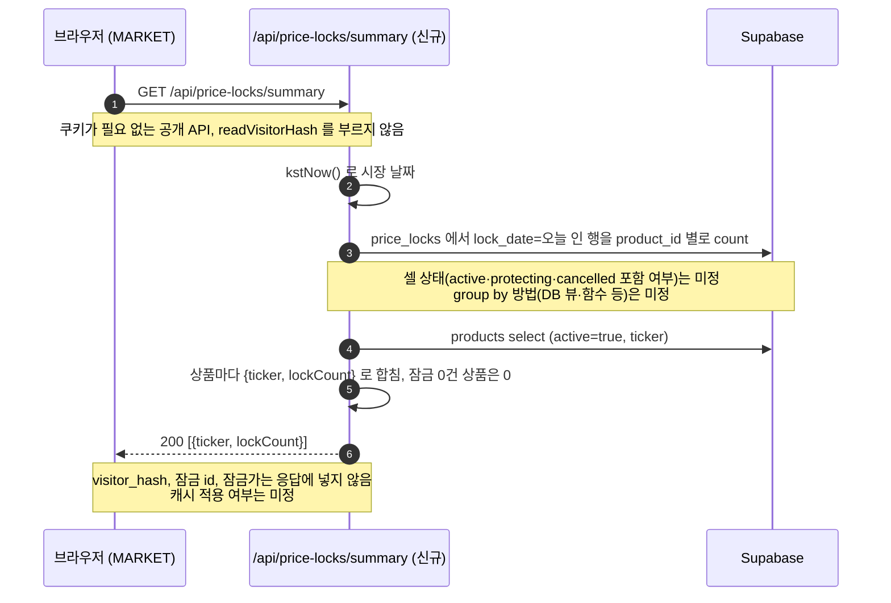
```mermaid
sequenceDiagram
    autonumber
    participant B as 브라우저 (MARKET)
    participant R as /api/price-locks/summary (신규)
    participant SB as Supabase

    B->>R: GET /api/price-locks/summary
    Note over B,R: 쿠키가 필요 없는 공개 API, readVisitorHash 를 부르지 않음
    R->>R: kstNow() 로 시장 날짜
    R->>SB: price_locks 에서 lock_date=오늘 인 행을 product_id 별로 count
    Note over R,SB: 셀 상태(active·protecting·cancelled 포함 여부)는 미정<br/>group by 방법(DB 뷰·함수 등)은 미정
    R->>SB: products select (active=true, ticker)
    R->>R: 상품마다 {ticker, lockCount} 로 합침, 잠금 0건 상품은 0
    R-->>B: 200 [{ticker, lockCount}]
    Note over R,B: visitor_hash, 잠금 id, 잠금가는 응답에 넣지 않음<br/>캐시 적용 여부는 미정
```

**읽는 법**

- 응답에는 상품별 숫자만 있다. `price_locks`의 방문자 열은 집계 안에서만 쓰이고 밖으로 나가지 않는다(PRD 142, 1107).
- 해지(F-A5)된 잠금을 수에서 뺄지는 문서에 없다. 셀 상태 목록이 정해지면 count 조건에 넣는다.
- 첫 화면에 바로 싣고 싶으면 `loadShellData`에 같은 조회를 넣을 수도 있다. PRD는 별도 API를 적어 두었다.

---

## F-A5. 가격 잠금 해지 (`DELETE /api/price-locks/:id`)

**한 줄 요약:** 현재 브라우저 쿠키에 묶인 잠금만 `cancelled`로 바꾼다. 행을 지우지 않으므로 `(visitor_hash, lock_date)` 유니크 제약이 남아, 같은 날 다시 잠그면 지금처럼 409가 난다 — 잠금권은 복구되지 않는다.

- 근거: PRD §16.13(801, 805, 807), §17 API 표(834), §22.5(1074), `supabase/schema.sql` `price_locks` 주석("해지해도 복구되지 않는다"), `lock_status` enum(`cancelled` 이미 있음), `cancelled_at` 컬럼(미사용)
- 현행 코드 연결: 신규 라우트 `app/api/price-locks/[id]/route.ts`. 쿠키 해시는 `lib/visitor.ts` `readVisitorHash`, 재잠금 거부는 `app/api/locks/route.ts` `POST`의 23505 분기, 오후 코드 발급 제외는 `lib/locks/lock-codes.ts` `issueLockCodes`(status=active만 조회), 화면은 `lib/bread-market/visitor-data.ts` `loadLock`과 `MarketPanel.tsx` `LockCard`
- 상태: 설계안(미구현)
- 선결 조건: 없음

### F-A5-a. 잠금 상태 전이

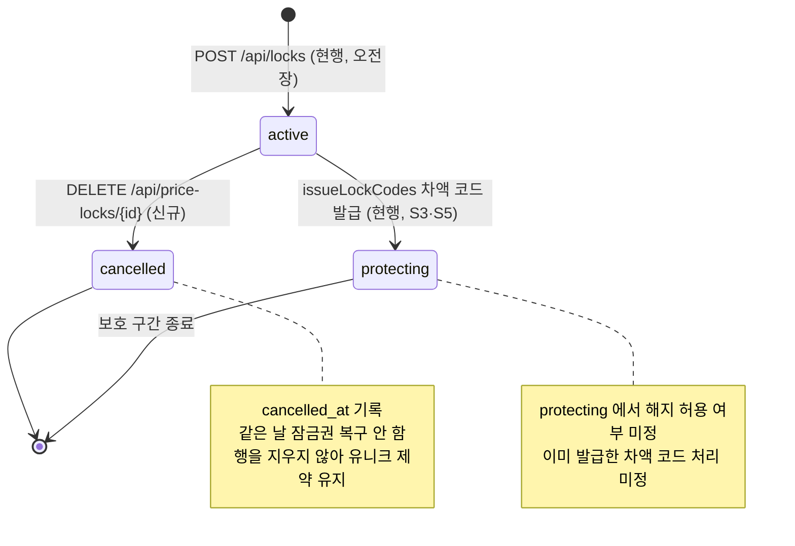
```mermaid
stateDiagram-v2
    [*] --> active : POST /api/locks (현행, 오전장)
    active --> protecting : issueLockCodes 차액 코드 발급 (현행, S3·S5)
    active --> cancelled : DELETE /api/price-locks/{id} (신규)
    cancelled --> [*]
    protecting --> [*] : 보호 구간 종료

    note right of cancelled
        cancelled_at 기록
        같은 날 잠금권 복구 안 함
        행을 지우지 않아 유니크 제약 유지
    end note
    note right of protecting
        protecting 에서 해지 허용 여부 미정
        이미 발급한 차액 코드 처리 미정
    end note
```

### F-A5-b. 해지 시퀀스

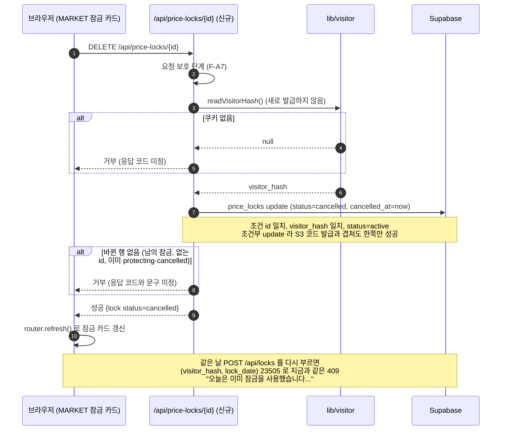
```mermaid
sequenceDiagram
    autonumber
    participant B as 브라우저 (MARKET 잠금 카드)
    participant R as /api/price-locks/{id} (신규)
    participant V as lib/visitor
    participant SB as Supabase

    B->>R: DELETE /api/price-locks/{id}
    R->>R: 요청 보호 단계 (F-A7)
    R->>V: readVisitorHash() (새로 발급하지 않음)
    alt 쿠키 없음
        V-->>R: null
        R-->>B: 거부 (응답 코드 미정)
    end
    V-->>R: visitor_hash
    R->>SB: price_locks update (status=cancelled, cancelled_at=now)
    Note over R,SB: 조건 id 일치, visitor_hash 일치, status=active<br/>조건부 update 라 S3 코드 발급과 겹쳐도 한쪽만 성공
    alt 바뀐 행 없음 (남의 잠금, 없는 id, 이미 protecting·cancelled)
        R-->>B: 거부 (응답 코드와 문구 미정)
    end
    R-->>B: 성공 {lock status=cancelled}
    B->>B: router.refresh() 로 잠금 카드 갱신
    Note over B,SB: 같은 날 POST /api/locks 를 다시 부르면<br/>(visitor_hash, lock_date) 23505 로 지금과 같은 409<br/>"오늘은 이미 잠금을 사용했습니다..."
```

**읽는 법**

- 해지는 행을 지우지 않고 상태만 바꾼다. 하루 1회 제한은 지금처럼 DB 유니크 제약이 지키므로 재잠금을 막는 코드를 새로 쓸 필요가 없다.
- 오후 크론의 코드 발급 명단(S3)은 `status=active`만 보므로 해지된 잠금은 자연히 빠진다. 해지와 발급이 동시에 일어나도 update 조건이 `status=active`라 한쪽만 이긴다.
- PRD §24 표는 "잠금 해지 시 잠금권"을 아직 "복구 안 함 제안"으로 적고 있다. 이 설계는 §16.13(807)과 `schema.sql` 주석을 따랐다.
- `loadLock`이 `cancelled`를 어떻게 보여줄지(카드 숨김 또는 "해지됨" 표시)는 화면 결정이라 미정이다.

---

## F-A6. 운영자 실패 알림

**한 줄 요약:** Cafe24 가격 반영이 실패하거나 OAuth 토큰 갱신이 실패하면, 지금처럼 DB에 실패를 남긴 뒤 "운영자 알림 채널(미정)"로 알린다. 가격 계산 결과는 그대로 둔다.

- 근거: PRD §11.4(487-488), §19(928), §22.3(1054)
- 현행 코드 연결: 실패가 모이는 곳은 `app/api/internal/daily-pricing/route.ts` `run`의 Cafe24 반영 `catch`(`cafe24_apply_status: "failed"`)와 마지막 `job_runs update`(`partially_failed`), `app/api/internal/reset-list-price/route.ts` `run`의 `catch`, `lib/cafe24/client.ts`의 `getAccessToken`(refresh_token 만료 throw)과 `requestToken`(`Cafe24 토큰 요청 실패` throw). 현행 흐름은 [S2](03-sequences.md#s2-오전-가격-산정-05시대-onlyifmissing1-재시도-포함)·[S3](03-sequences.md#s3-오후-가격-산정과-잠금-차액-코드-발급)·[S4](03-sequences.md#s4-0200-정가-복귀)·[S7-b](03-sequences.md#s7-b-admin-api-호출-때-토큰-자동-갱신-cafe24request)
- 상태: 설계안(미구현)
- 선결 조건: 알림 채널 결정

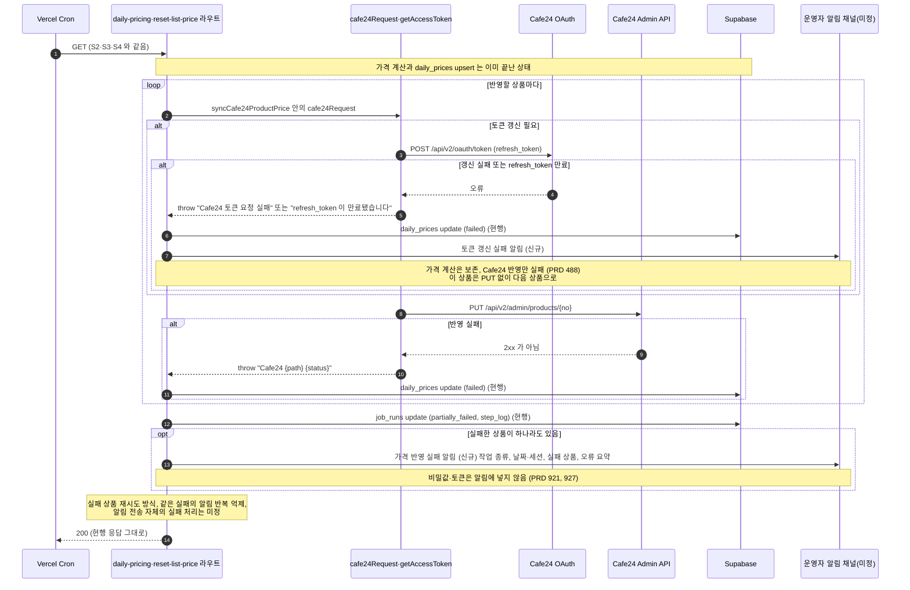
```mermaid
sequenceDiagram
    autonumber
    participant CR as Vercel Cron
    participant R as daily-pricing·reset-list-price 라우트
    participant CL as cafe24Request·getAccessToken
    participant OA as Cafe24 OAuth
    participant C24 as Cafe24 Admin API
    participant SB as Supabase
    participant AL as 운영자 알림 채널(미정)

    CR->>R: GET (S2·S3·S4 와 같음)
    Note over R,SB: 가격 계산과 daily_prices upsert 는 이미 끝난 상태
    loop 반영할 상품마다
        R->>CL: syncCafe24ProductPrice 안의 cafe24Request
        alt 토큰 갱신 필요
            CL->>OA: POST /api/v2/oauth/token (refresh_token)
            alt 갱신 실패 또는 refresh_token 만료
                OA-->>CL: 오류
                CL-->>R: throw "Cafe24 토큰 요청 실패" 또는 "refresh_token 이 만료됐습니다"
                R->>SB: daily_prices update (failed) (현행)
                R->>AL: 토큰 갱신 실패 알림 (신규)
                Note over R,AL: 가격 계산은 보존, Cafe24 반영만 실패 (PRD 488)<br/>이 상품은 PUT 없이 다음 상품으로
            end
        end
        CL->>C24: PUT /api/v2/admin/products/{no}
        alt 반영 실패
            C24-->>CL: 2xx 가 아님
            CL-->>R: throw "Cafe24 {path} {status}"
            R->>SB: daily_prices update (failed) (현행)
        end
    end
    R->>SB: job_runs update (partially_failed, step_log) (현행)
    opt 실패한 상품이 하나라도 있음
        R->>AL: 가격 반영 실패 알림 (신규) 작업 종류, 날짜·세션, 실패 상품, 오류 요약
        Note over R,AL: 비밀값·토큰은 알림에 넣지 않음 (PRD 921, 927)
    end
    Note over R: 실패 상품 재시도 방식, 같은 실패의 알림 반복 억제,<br/>알림 전송 자체의 실패 처리는 미정
    R-->>CR: 200 (현행 응답 그대로)
```

**읽는 법**

- 알림은 이미 있는 실패 분기 뒤에 한 줄 붙이는 형태다. `daily_prices`·`job_runs`에 실패를 남기는 지금 동작은 바꾸지 않는다.
- 토큰 실패는 상품마다 되풀이될 수 있다. 상품별로 보낼지, 작업 끝에 한 번 모아 보낼지는 채널과 함께 정한다(미정).
- 잠금·예측 코드 발급 실패(`lockCodes`·`predictions`의 `failed`)는 PRD §19 알림 대상에 없어 그리지 않았다.

---

## F-A7. API 속도 제한·CSRF 방어

**한 줄 요약:** 쿠키로 상태를 바꾸는 공개 POST·DELETE 라우트 앞에 본문 크기 제한 → CSRF 검사 → 속도 제한 → 입력 검증 순서의 보호 단계를 둔다. 저장소와 구현 위치는 문서에 없어 "방식 미정"이다.

- 근거: PRD §13.5(582), §19(924-926), §21.4(1025)
- 현행 코드 연결: 대상 라우트 `app/api/locks/route.ts` `POST`, `app/api/predictions/route.ts` `POST`, `app/api/predictions/instant/route.ts` `POST`, 신규 `app/api/events/route.ts`, 신규 `app/api/price-locks/[id]/route.ts` `DELETE`. 지금은 `proxy.ts`(Next 16의 요청 가로채기 파일)가 없고, 쿠키는 `lib/visitor.ts`에서 `SameSite=Lax`로 발급한다
- 상태: 설계안(미구현)
- 선결 조건: 속도 제한 저장소·수치, CSRF 검사 방식 결정

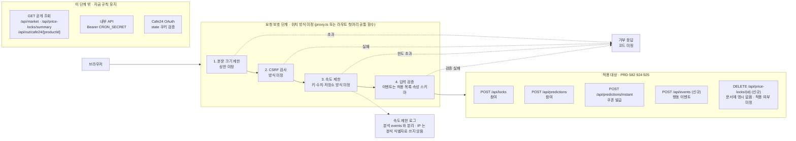
```mermaid
flowchart LR
    B["브라우저"] --> P

    subgraph P["요청 보호 단계 · 위치 방식 미정 (proxy.ts 또는 라우트 첫머리 공통 함수)"]
        direction TB
        P1["1. 본문 크기 제한<br/>상한 미정"] --> P2["2. CSRF 검사<br/>방식 미정"]
        P2 --> P3["3. 속도 제한<br/>키·수치·저장소 방식 미정"]
        P3 --> P4["4. 입력 검증<br/>이벤트는 허용 목록·속성 스키마"]
    end

    P4 --> T

    subgraph T["적용 대상 · PRD 582 924 925"]
        T1["POST /api/locks<br/>참여"]
        T2["POST /api/predictions<br/>참여"]
        T3["POST /api/predictions/instant<br/>쿠폰 발급"]
        T4["POST /api/events (신규)<br/>행동 이벤트"]
        T5["DELETE /api/price-locks/{id} (신규)<br/>문서에 명시 없음 · 적용 여부 미정"]
    end

    X1["거부 응답<br/>코드 미정"]
    P1 -.->|"초과"| X1
    P2 -.->|"실패"| X1
    P3 -.->|"한도 초과"| X1
    P4 -.->|"검증 실패"| X1

    subgraph N["이 단계 밖 · 지금 규칙 유지"]
        N1["GET 공개 조회<br/>/api/market · /api/price-locks/summary<br/>/api/out/cafe24/[productId]"]
        N2["내부 API<br/>Bearer CRON_SECRET"]
        N3["Cafe24 OAuth<br/>state 쿠키 검증"]
    end

    LOG["속도 제한 로그<br/>분석 events 와 분리 · IP 는 분석 식별자로 쓰지 않음"]
    P3 -.-> LOG
```

**읽는 법**

- 대상은 PRD가 이름을 댄 참여(잠금·예측), 쿠폰 발급, 행동 이벤트 API다. 인증메일 API도 PRD 대상이지만 이메일 인증은 범위 밖이라 뺐다.
- 네 단계의 순서는 이 설계안의 제안이다. 싼 검사(크기)를 먼저 하고, 비용이 드는 DB 조회는 모든 검사를 통과한 뒤에만 한다는 뜻이다.
- 쿠키가 이미 `SameSite=Lax`라 다른 사이트에서 보낸 POST에는 쿠키가 실리지 않는다. 다만 PRD는 CSRF 방어를 따로 요구하므로 2단계를 둔다.
- 속도 제한 키로 IP를 쓰더라도 그 기록은 보안 로그에만 두고 `events`에는 넣지 않는다(PRD 1025).

---

## F-A8. 예측 판정 정정 기록

**한 줄 요약:** 이미 확정한 예측 결과를 산식·데이터 사후 수정 때문에 고쳐야 할 때, 조용히 덮어쓰지 않고 `prediction_rounds`에 판정 버전과 사유를 남긴다. 이미 준 보상은 회수하지 않는다.

- 근거: PRD §13.3(562), §16.5(708), `supabase/schema.sql` `prediction_rounds.resolution_version`·`void_reason`(185-186행, 미사용), `round_status` enum(`resolved`, `void` 이미 있음)
- 현행 코드 연결: 판정은 `lib/predictions/resolve.ts` `resolvePredictions`가 `prediction_entries`만 update하고 `prediction_rounds`는 건드리지 않는다(회차는 `open`만 씀). 정정 절차는 이 함수 밖의 운영 작업으로 붙는다
- 상태: 설계안(미구현)
- 선결 조건: 정정을 누가 어떤 경로로 실행할지(운영자 수동 작업 등) 결정

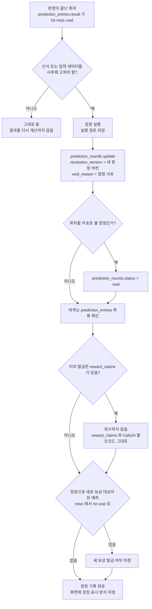
```mermaid
flowchart TD
    A["판정이 끝난 회차<br/>prediction_entries.result 가 hit·miss·void"] --> B{"산식 또는 입력 데이터를<br/>사후에 고쳐야 함?"}
    B -->|"아니오"| K["그대로 둠<br/>결과를 다시 계산하지 않음"]
    B -->|"예"| C["정정 실행<br/>실행 경로 미정"]
    C --> D["prediction_rounds update<br/>resolution_version = 새 판정 버전<br/>void_reason = 정정 사유"]
    D --> E{"회차를 무효로 볼 정정인가?"}
    E -->|"예"| E1["prediction_rounds.status = void"]
    E -->|"아니오"| F
    E1 --> F["바뀌는 prediction_entries 목록 확인"]
    F --> G{"이미 발급한 reward_claims 가 있음?"}
    G -->|"예"| H["회수하지 않음<br/>reward_claims 와 Cafe24 할인코드 그대로"]
    G -->|"아니오"| I
    H --> I{"정정으로 새로 보상 대상이 된 예측<br/>miss 에서 hit·void 로"}
    I -->|"있음"| I1["새 보상 발급 여부 미정"]
    I -->|"없음"| J["정정 기록 완료<br/>화면에 정정 표시 방식 미정"]
    I1 --> J
```

**읽는 법**

- 핵심은 두 가지다. 결과를 바꿀 때는 반드시 버전과 사유가 함께 남고, 이미 나간 할인코드는 회수하지 않는다(PRD 562).
- `resolution_version`의 값 형식(산식 버전을 쓸지, 정정 번호를 쓸지)과 첫 판정 때도 채울지는 미정이다.
- 판정 가격 누락 때 회차 전체를 무효로 할지 정상 상품만 판정할지는 PRD §24에 결정 필요 항목으로 남아 있다. 여기서는 "무효로 볼 정정인가"라는 분기로만 두었다.

---

## F-A9. 할인코드 사용 추적 (`reward_claims.status=used`)

**한 줄 요약:** 동기화 작업이 Cafe24에서 우리가 발급한 할인코드의 사용 여부를 읽어, 쓰인 코드의 `reward_claims`를 `status=used`, `used_at`으로 바꾼다. 누가 샀는지(주문과 방문자 연결)는 기록하지 않는다.

- 근거: PRD §3 지표 "발송 쿠폰 대비 등록·사용률"(63), §16.7(730-731), §21.4(1024), `supabase/schema.sql` `claim_status`(`used` 이미 있음)·`reward_claims.used_at`(미사용), `research/네이버-검색지수-도착시각.md` 168행("Cafe24 주문 조회 권한이 토큰에 없어")
- 현행 코드 연결: 코드 발급은 `lib/rewards/discount-code.ts` `createDiscountCode`, 행 생성은 `lib/locks/lock-codes.ts`·`lib/predictions/resolve.ts`·`app/api/predictions/instant/route.ts`(모두 `status=issued`). Cafe24 호출은 `lib/cafe24/client.ts` `cafe24Request`, 권한 목록은 `app/api/auth/cafe24/start/route.ts`의 `SCOPES`
- 상태: 설계안(미구현)
- 선결 조건: Cafe24 주문 읽기 scope 추가(현재 `SCOPES`는 상품·프로모션 읽기·쓰기 4개뿐)와 운영자 재동의(S7-a)

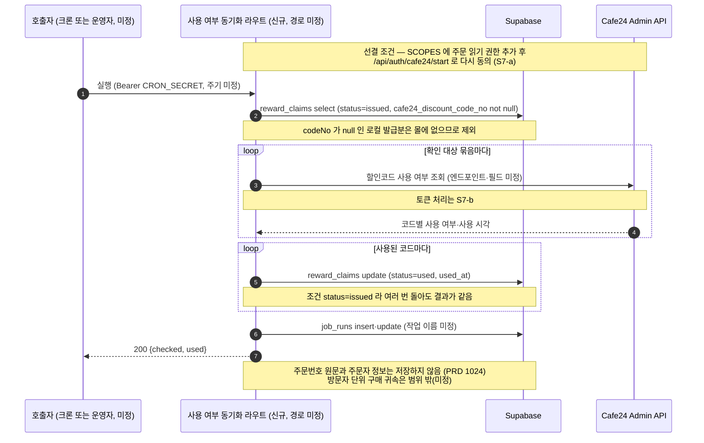
```mermaid
sequenceDiagram
    autonumber
    participant CR as 호출자 (크론 또는 운영자, 미정)
    participant R as 사용 여부 동기화 라우트 (신규, 경로 미정)
    participant SB as Supabase
    participant C24 as Cafe24 Admin API

    Note over R,C24: 선결 조건 — SCOPES 에 주문 읽기 권한 추가 후<br/>/api/auth/cafe24/start 로 다시 동의 (S7-a)
    CR->>R: 실행 (Bearer CRON_SECRET, 주기 미정)
    R->>SB: reward_claims select (status=issued, cafe24_discount_code_no not null)
    Note over R,SB: codeNo 가 null 인 로컬 발급분은 몰에 없으므로 제외
    loop 확인 대상 묶음마다
        R->>C24: 할인코드 사용 여부 조회 (엔드포인트·필드 미정)
        Note over R,C24: 토큰 처리는 S7-b
        C24-->>R: 코드별 사용 여부·사용 시각
    end
    loop 사용된 코드마다
        R->>SB: reward_claims update (status=used, used_at)
        Note over R,SB: 조건 status=issued 라 여러 번 돌아도 결과가 같음
    end
    R->>SB: job_runs insert·update (작업 이름 미정)
    R-->>CR: 200 {checked, used}
    Note over R,SB: 주문번호 원문과 주문자 정보는 저장하지 않음 (PRD 1024)<br/>방문자 단위 구매 귀속은 범위 밖(미정)
```

**읽는 법**

- 이 작업은 코드 한 장이 쓰였는지만 기록한다. 지표 "발급 코드 대비 사용률"을 셀 수 있게 되지만, 그 주문을 특정 방문자의 구매로 잇지는 않는다(PRD 1099).
- 사용 여부를 할인코드 쪽 API에서 읽을지 주문 API에서 읽을지는 Cafe24 문서 확인이 필요하다(미정). 주문 API라면 선결 조건의 scope가 꼭 필요하다.
- 만료된 코드를 `expired`로 바꾸는 일은 이 설계에 넣지 않았다. 지금 화면은 `valid_until`로 만료를 판단한다(`visitor-data.ts`).

---

## F-A10. 운영자 기준가·상품번호 변경과 변경 이력

**한 줄 요약:** 운영자가 `products.base_price_won`이나 `cafe24_product_no`를 바꿀 때마다 변경 전·후 값, 실행자, 시각을 이력 테이블(신규)에 남기고, `products.valid_from`에 지금 값의 적용 시작일을 적는다.

- 근거: PRD §7 상품 표 아래(293), §19(931), `supabase/schema.sql` `products.valid_from`·`valid_to`(42-43행, 미사용)
- 현행 코드 연결: `cafe24_product_no`는 지금 `app/api/internal/sync-products/route.ts` `POST`가 이력 없이 update한다([S9](03-sequences.md#s9-상품번호-동기화)). 기준가는 바꾸는 코드가 없고, 가격 산정(`daily-pricing` `run`)이 매번 `products`에서 읽는다
- 상태: 설계안(미구현)
- 선결 조건: 운영자 변경 경로(라우트·인증 방식) 결정, 이력 테이블 migration

### F-A10-a. 이력 테이블 ERD

이력 테이블 이름과 컬럼 이름은 문서에 없어 가칭으로 적었다.

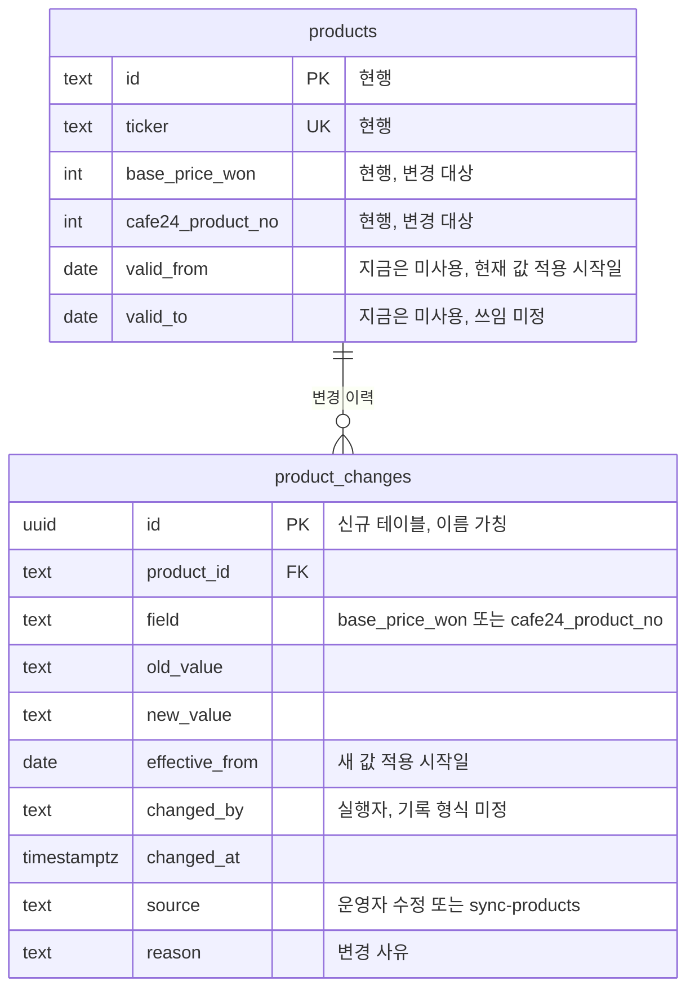
```mermaid
erDiagram
    products {
        text id PK "현행"
        text ticker UK "현행"
        int base_price_won "현행, 변경 대상"
        int cafe24_product_no "현행, 변경 대상"
        date valid_from "지금은 미사용, 현재 값 적용 시작일"
        date valid_to "지금은 미사용, 쓰임 미정"
    }
    product_changes {
        uuid id PK "신규 테이블, 이름 가칭"
        text product_id FK
        text field "base_price_won 또는 cafe24_product_no"
        text old_value
        text new_value
        date effective_from "새 값 적용 시작일"
        text changed_by "실행자, 기록 형식 미정"
        timestamptz changed_at
        text source "운영자 수정 또는 sync-products"
        text reason "변경 사유"
    }

    products ||--o{ product_changes : "변경 이력"
```

### F-A10-b. 변경 시퀀스

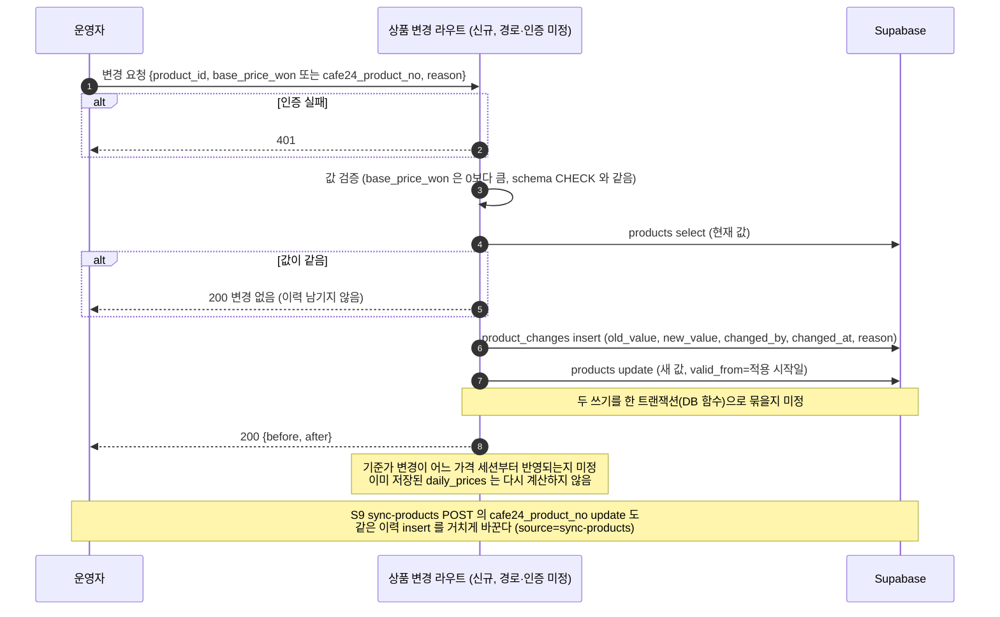
```mermaid
sequenceDiagram
    autonumber
    participant O as 운영자
    participant R as 상품 변경 라우트 (신규, 경로·인증 미정)
    participant SB as Supabase

    O->>R: 변경 요청 {product_id, base_price_won 또는 cafe24_product_no, reason}
    alt 인증 실패
        R-->>O: 401
    end
    R->>R: 값 검증 (base_price_won 은 0보다 큼, schema CHECK 와 같음)
    R->>SB: products select (현재 값)
    alt 값이 같음
        R-->>O: 200 변경 없음 (이력 남기지 않음)
    end
    R->>SB: product_changes insert (old_value, new_value, changed_by, changed_at, reason)
    R->>SB: products update (새 값, valid_from=적용 시작일)
    Note over R,SB: 두 쓰기를 한 트랜잭션(DB 함수)으로 묶을지 미정
    R-->>O: 200 {before, after}
    Note over R: 기준가 변경이 어느 가격 세션부터 반영되는지 미정<br/>이미 저장된 daily_prices 는 다시 계산하지 않음
    Note over O,SB: S9 sync-products POST 의 cafe24_product_no update 도<br/>같은 이력 insert 를 거치게 바꾼다 (source=sync-products)
```

**읽는 법**

- `products`는 `id`가 기본 키라 상품당 한 행뿐이다. 그래서 과거 값은 `products`의 `valid_from`·`valid_to`만으로는 남길 수 없고 이력 테이블이 따로 필요하다. `valid_to`를 어디에 쓸지는 미정이다.
- `daily_prices`에는 이미 계산 결과가 남으므로, 기준가를 바꿔도 지난 가격은 그대로다. 이력 테이블은 "그날 가격이 왜 그 기준가로 계산됐는지"를 되짚는 데 쓴다.
- 상품번호는 지금도 S9가 바꾸고 있어, 이력을 붙이는 첫 자리는 `sync-products` `POST`의 update 루프다.

---

## F-A11. Cafe24 가격 반영 감사 로그 (`audit_logs`)

**한 줄 요약:** Cafe24 판매가를 바꿀 때마다 변경 전 가격, 목표 가격, 변경 후 가격, 응답 상태를 `audit_logs`(신규)에 한 행씩 남긴다. `job_runs`는 작업 단위 기록, `audit_logs`는 상품 단위 기록이다.

- 근거: PRD §12.3(514-518), §16.8(733-741), §19(931), §22.3(1054), `supabase/schema.sql` `cafe24_status`(`skipped_same_price` 이미 있음, 미사용)
- 현행 코드 연결: `lib/cafe24/price-sync.ts` `syncCafe24ProductPrice`(S2·S3·S4가 함께 쓰는 PUT 함수). 호출하는 곳은 `app/api/internal/daily-pricing/route.ts` `run`, `app/api/internal/reset-list-price/route.ts` `run`. 지금은 PUT 전에 상품 가격을 GET하지 않는다(옵션 `variants`만 GET)
- 상태: 설계안(미구현)
- 선결 조건: `audit_logs` migration

### F-A11-a. 감사 로그 ERD

컬럼 이름은 PRD 518·931의 항목을 옮긴 설계안이다.

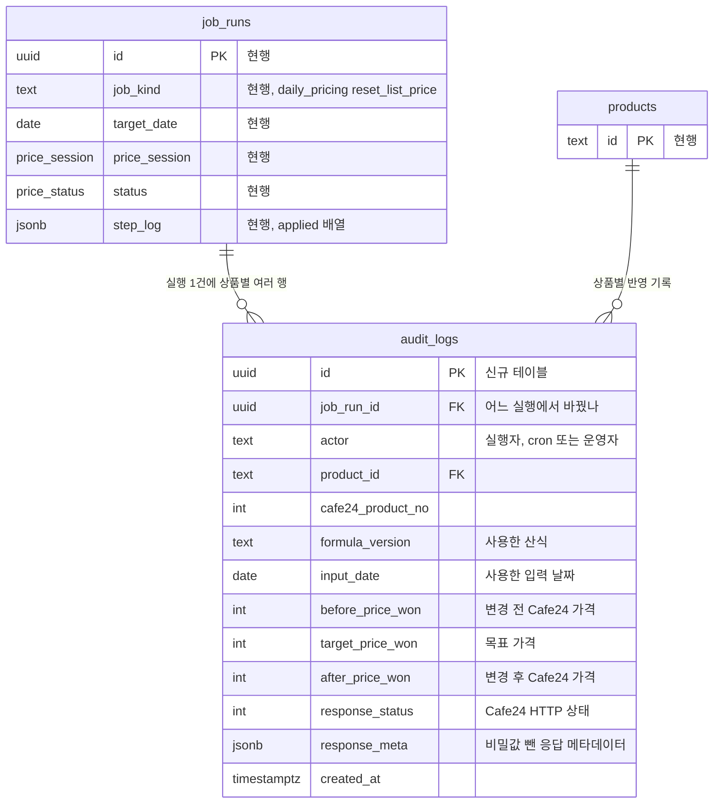
```mermaid
erDiagram
    job_runs {
        uuid id PK "현행"
        text job_kind "현행, daily_pricing reset_list_price"
        date target_date "현행"
        price_session price_session "현행"
        price_status status "현행"
        jsonb step_log "현행, applied 배열"
    }
    audit_logs {
        uuid id PK "신규 테이블"
        uuid job_run_id FK "어느 실행에서 바꿨나"
        text actor "실행자, cron 또는 운영자"
        text product_id FK
        int cafe24_product_no
        text formula_version "사용한 산식"
        date input_date "사용한 입력 날짜"
        int before_price_won "변경 전 Cafe24 가격"
        int target_price_won "목표 가격"
        int after_price_won "변경 후 Cafe24 가격"
        int response_status "Cafe24 HTTP 상태"
        jsonb response_meta "비밀값 뺀 응답 메타데이터"
        timestamptz created_at
    }
    products {
        text id PK "현행"
    }

    job_runs ||--o{ audit_logs : "실행 1건에 상품별 여러 행"
    products ||--o{ audit_logs : "상품별 반영 기록"
```

### F-A11-b. S2 PUT 구간에 감사 로그 추가

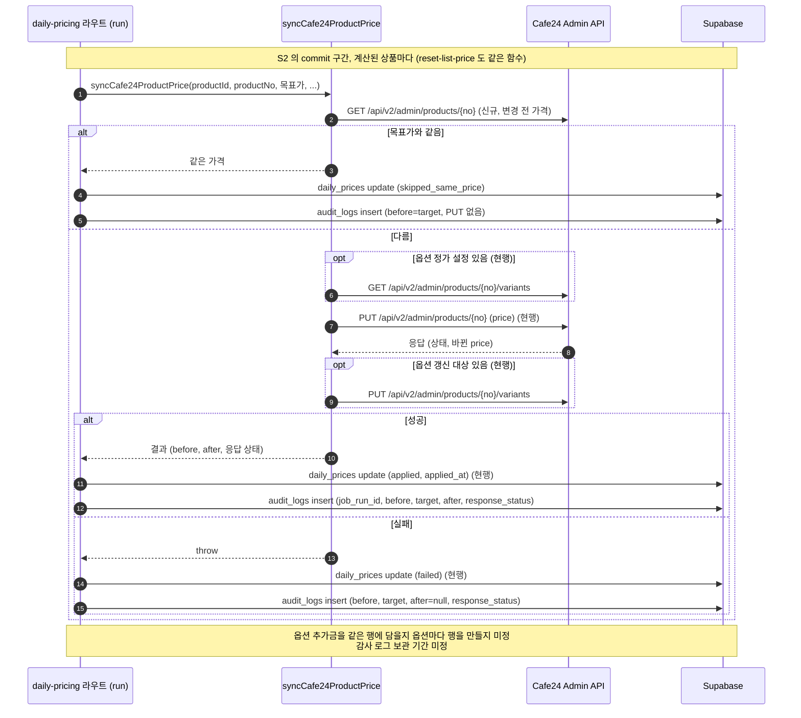
```mermaid
sequenceDiagram
    autonumber
    participant R as daily-pricing 라우트 (run)
    participant PS as syncCafe24ProductPrice
    participant C24 as Cafe24 Admin API
    participant SB as Supabase

    Note over R,SB: S2 의 commit 구간, 계산된 상품마다 (reset-list-price 도 같은 함수)
    R->>PS: syncCafe24ProductPrice(productId, productNo, 목표가, ...)
    PS->>C24: GET /api/v2/admin/products/{no} (신규, 변경 전 가격)
    alt 목표가와 같음
        PS-->>R: 같은 가격
        R->>SB: daily_prices update (skipped_same_price)
        R->>SB: audit_logs insert (before=target, PUT 없음)
    else 다름
        opt 옵션 정가 설정 있음 (현행)
            PS->>C24: GET /api/v2/admin/products/{no}/variants
        end
        PS->>C24: PUT /api/v2/admin/products/{no} (price) (현행)
        C24-->>PS: 응답 (상태, 바뀐 price)
        opt 옵션 갱신 대상 있음 (현행)
            PS->>C24: PUT /api/v2/admin/products/{no}/variants
        end
        alt 성공
            PS-->>R: 결과 (before, after, 응답 상태)
            R->>SB: daily_prices update (applied, applied_at) (현행)
            R->>SB: audit_logs insert (job_run_id, before, target, after, response_status)
        else 실패
            PS-->>R: throw
            R->>SB: daily_prices update (failed) (현행)
            R->>SB: audit_logs insert (before, target, after=null, response_status)
        end
    end
    Note over R,SB: 옵션 추가금을 같은 행에 담을지 옵션마다 행을 만들지 미정<br/>감사 로그 보관 기간 미정
```

**읽는 법**

- PUT 전 GET은 PRD 514-515("값이 다를 때만 PUT")에 이미 적혀 있는 단계다. 이 GET이 있어야 "변경 전 가격"을 남길 수 있고, `skipped_same_price` 상태도 처음 쓰이게 된다.
- `audit_logs` insert는 `daily_prices` 상태 update 바로 옆에 둔다. 두 곳 모두 `run` 안의 같은 `try`·`catch`에 있어 실패해도 행이 남는다.
- `syncCafe24ProductPrice`는 작업 ID를 모르므로 insert는 호출하는 쪽(`run`)이 한다. 함수는 before·after·응답 상태를 돌려주기만 한다.

---

## F-A12. 개인정보 처리방침·쿠키 안내

**한 줄 요약:** 첫 방문자에게 쿠키 안내를 보여주고, 분석 동의 선택을 F-A3의 `analytics_consent`에 기록한다. 개인정보 처리방침에는 익명 ID(`visitor_hash`)를 온라인 식별자로 포함해 목적·보관 기간·파기 방법·처리 위탁사를 적는다.

- 근거: PRD §14(603), §21.4(1027-1029), §23 출시 기준(1112)
- 현행 코드 연결: 쿠키는 `lib/visitor.ts` `getOrCreateVisitorHash`가 잠금·예측·바로 받기 때 발급한다. 화면 틀은 `components/bread-market/Shell.tsx` `BreadMarketShell`. 처리방침 페이지와 안내 UI는 없다. 저장되는 개인 정보 현황은 [E3](02-erd.md#e3-고객-데이터-erd-개인-정보-관리)
- 상태: 설계안(미구현)
- 선결 조건: 처리방침 본문(보관 기간·위탁사) 확정, F-A3 동의 컬럼 사용

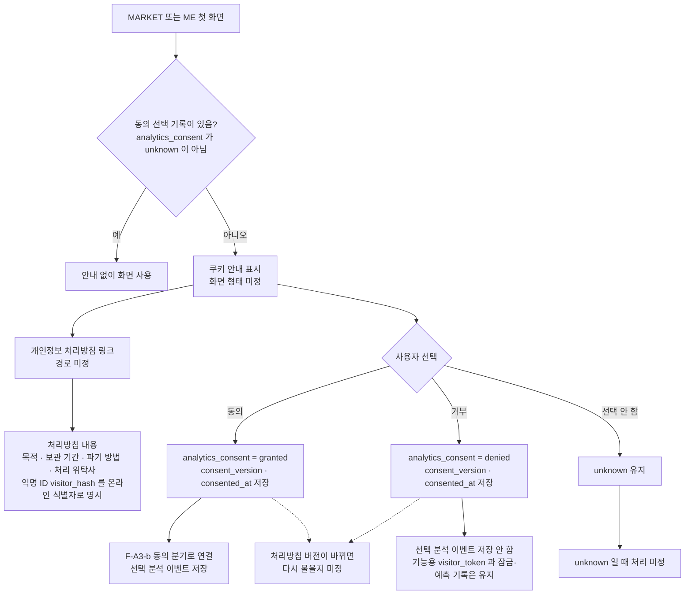
```mermaid
flowchart TD
    A["MARKET 또는 ME 첫 화면"] --> B{"동의 선택 기록이 있음?<br/>analytics_consent 가 unknown 이 아님"}
    B -->|"예"| Z["안내 없이 화면 사용"]
    B -->|"아니오"| C["쿠키 안내 표시<br/>화면 형태 미정"]
    C --> D["개인정보 처리방침 링크<br/>경로 미정"]
    D --> D1["처리방침 내용<br/>목적 · 보관 기간 · 파기 방법 · 처리 위탁사<br/>익명 ID visitor_hash 를 온라인 식별자로 명시"]
    C --> E{"사용자 선택"}
    E -->|"동의"| G["analytics_consent = granted<br/>consent_version · consented_at 저장"]
    E -->|"거부"| H["analytics_consent = denied<br/>consent_version · consented_at 저장"]
    E -->|"선택 안 함"| U["unknown 유지"]
    G --> S["F-A3-b 동의 분기로 연결<br/>선택 분석 이벤트 저장"]
    H --> X["선택 분석 이벤트 저장 안 함<br/>기능용 visitor_token 과 잠금·예측 기록은 유지"]
    U --> Q["unknown 일 때 처리 미정"]
    G -.-> V["처리방침 버전이 바뀌면<br/>다시 물을지 미정"]
    H -.-> V
```

**읽는 법**

- 동의 기록은 `anonymous_visitors`의 세 컬럼(`analytics_consent`, `consent_version`, `consented_at`)에 남는다. 이 컬럼들은 지금 스키마에 있지만 비어 있다([E3](02-erd.md#e3-고객-데이터-erd-개인-정보-관리)).
- 동의를 받으려면 `visitor_hash`가 있어야 한다. 쿠키가 없는 첫 방문자에게 언제 발급할지는 F-A3과 같은 미정 항목이다. 동의 값을 받는 라우트도 PRD §17 API 표에 없어 미정이다.
- 처리 위탁사 목록은 법률 검토 대상이라 미정이다. 참고로 지금 구성에서 방문자 데이터가 지나가는 곳은 Vercel(앱), Supabase(DB), Cafe24(할인코드·쇼핑몰)이다([A1](01-architecture.md#a1-시스템-컨텍스트)).

---

## 미정으로 남긴 값

문서가 정하지 않아 이 설계에서 값을 넣지 않은 항목이다. PRD §24에 "제안"으로만 적힌 값도 확정이 아니므로 여기에 넣었다.

| 항목 | 관련 | 문서 상태 |
|---|---|---|
| 원시 행동 이벤트 보관 기간, 집계 데이터 보관 기간 | F-A1, F-A3 | PRD §24 "90일 제안", 집계 쪽은 없음 (PRD 1027는 둘을 나누라고만 함) |
| 개인정보 보관 기간·파기 방법 | F-A12 | PRD §24 "만료 후 30일 내 삭제 제안" |
| 감사 로그 보관 기간 | F-A11 | 없음 |
| `/api/events` 본문 크기 상한 | F-A1, F-A7 | 없음 |
| 선택 분석 이벤트 분류 (어떤 이벤트가 동의 필요) | F-A1, F-A3, F-A12 | 없음 (PRD 1028은 제어할 수 있어야 한다고만 함) |
| 동의 `unknown` 상태에서 선택 이벤트 처리 | F-A3, F-A12 | 없음 |
| 첫 방문자 `visitor_token` 발급 위치 | F-A1, F-A2, F-A3 | PRD 985 "시세 페이지 요청 때"만 적힘. 구현 위치 없음 |
| 이벤트 전송 방식 (재전송 규칙 포함) | F-A1 | 없음 |
| 서버 이벤트를 트랜잭션으로 묶을지 후속 작업으로 남길지 | F-A1 | PRD 991이 둘 다 허용 |
| `lock_code_sent`·`reward_coupon_sent`의 뜻 (발급과 같은지) | F-A1 | 이메일 발송 전제로만 정의됨 |
| `price_lock_created`의 잠금가 구간 폭 | F-A1 | 없음 |
| 바로 받기 이벤트 이름 | F-A1 | PRD에 없음 |
| 구매 이동 기록 실패 때 이동을 계속할지 | F-A2 | 없음 |
| UTM 허용 길이·문자 규칙의 구체 값 | F-A3 | PRD 762 "검증한다"만 적힘 |
| 공개 잠금 집계에 셀 상태, 집계 방법, 캐시 | F-A4 | 없음 |
| `/api/locks`와 PRD `/api/price-locks` 경로 이름 통일 | F-A4, F-A5 | 없음 |
| `protecting` 잠금 해지 허용 여부와 발급된 차액 코드 처리 | F-A5 | 없음 |
| 해지 가능 시간대, 해지 실패 응답 코드·문구, 해지 잠금 화면 표시 | F-A5 | 없음 |
| 운영자 알림 채널 | F-A6 | 없음 |
| 알림 단위(상품별·작업별), 반복 억제, 알림 전송 실패 처리 | F-A6 | 없음 |
| Cafe24 반영 실패 상품 재시도 방식 | F-A6 | PRD 487 "재시도한다"만 적힘 |
| 요청 보호 단계 구현 위치 (`proxy.ts` 또는 공통 함수) | F-A7 | 없음 |
| CSRF 검사 방식 | F-A7 | 없음 |
| 속도 제한 키·수치·저장소 | F-A7 | 없음 |
| `DELETE /api/price-locks/{id}`에 보호 단계 적용 여부 | F-A7 | PRD 582·924 대상 목록에 없음 |
| 보호 단계 거부 응답 코드 | F-A7 | 없음 |
| 판정 정정 실행 경로와 `resolution_version` 값 형식 | F-A8 | 없음 |
| 정정으로 새로 보상 대상이 된 예측의 보상 발급 여부, 화면 표시 | F-A8 | 없음 (회수하지 않는다는 것만 정해짐) |
| 판정 가격 누락 때 회차 무효 범위 | F-A8 | PRD §24 결정 필요 항목 |
| 할인코드 사용 여부 조회 API·필드, 필요한 scope 이름 | F-A9 | 없음 (주문 조회 권한이 없다는 사실만 기록됨) |
| 사용 동기화 작업의 호출자·주기·경로·`job_kind` 이름 | F-A9 | 없음 |
| 상품 변경 라우트 경로·인증 방식 | F-A10 | 없음 |
| 이력 테이블 이름·`changed_by` 형식, `products.valid_to`의 쓰임 | F-A10 | PRD 293 "이력을 남긴다"만 적힘 |
| 기준가 변경이 반영되는 시작 가격 세션 | F-A10 | 없음 |
| 옵션 추가금 감사 로그를 한 행에 담을지 | F-A11 | 없음 |
| 쿠키 안내 화면 형태, 처리방침 페이지 경로, 동의 저장 라우트 | F-A12 | 없음 |
| 처리 위탁사 목록 | F-A12 | PRD 603 "표시한다"만 적힘 |
| 처리방침 버전이 바뀔 때 다시 동의를 받을지 | F-A12 | 없음 |
