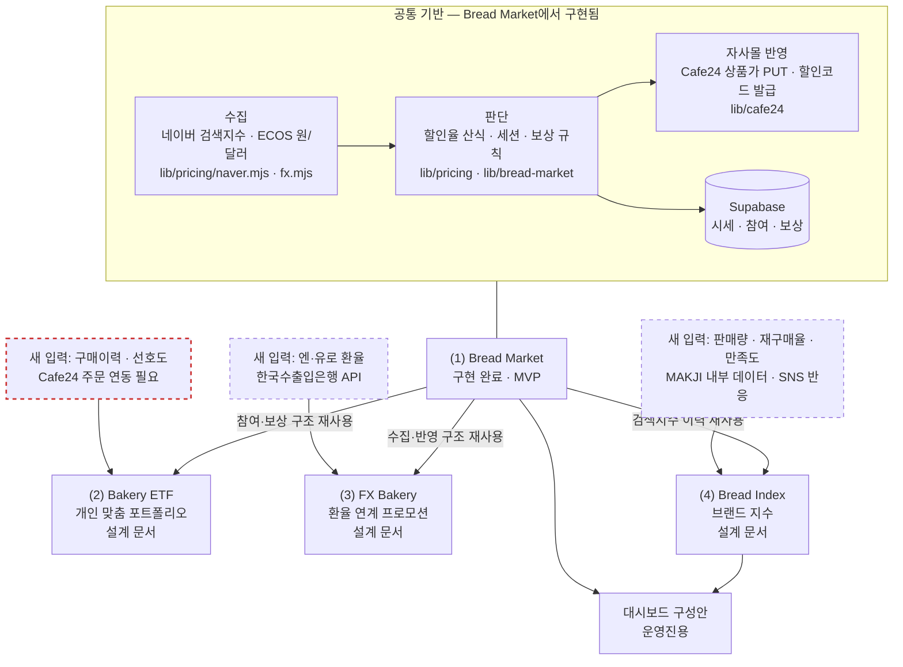
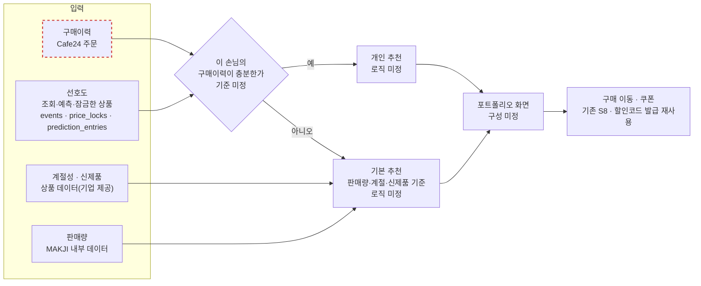
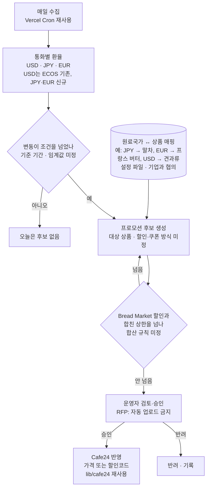
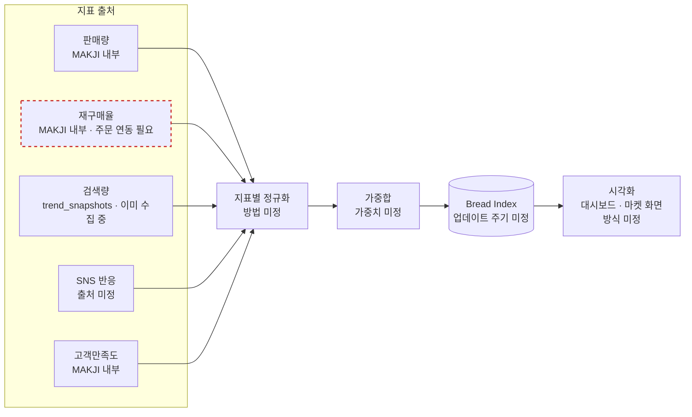
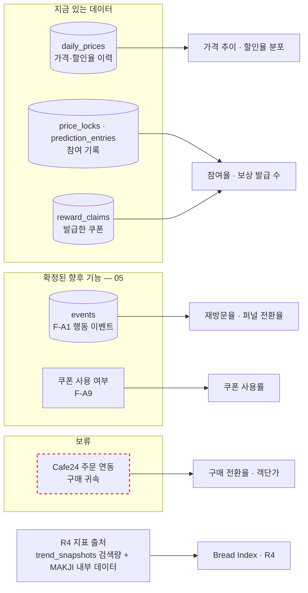

# 06. RFP 확장 영역 개념 구조 (R1~R5)

> 이 문서는 **개념 설계**다. 코드도, 확정된 규칙도 없다. 현재 구현은 01~04, 확정된 향후 기능은 05를 본다.

- 근거: [기업 요구사항](../기업_요구사항.md) 3-1 "프로젝트 범위 및 산출물", 3-2 데이터셋, 3-3 구현 흐름, 3-4 평가 포인트
- 범위: RFP 영역 (2) Bakery ETF, (3) FX Bakery, (4) Bread Index와 대시보드 구성안. RFP는 이 셋을 "기획/설계 문서" 산출물로 정했다. 여기서는 **각 영역이 이미 만든 Bread Market 기반과 어디서 이어지는지**만 그린다.
- 규칙·가중치·추천 로직·할인율처럼 RFP가 예시로만 든 값은 모두 "미정"으로 두었다. 파일 끝 [미정으로 남긴 값](#미정으로-남긴-값)에 모았다.
- 현재 코드 경로는 `prototype-n-development/makji-stock/` 기준이다.
- 작성일: 2026-09-23

| ID | 이름 | 다이어그램 |
|---|---|---|
| R1 | 확장 로드맵과 공통 기반 | flowchart |
| R2 | Bakery ETF 개인 맞춤 포트폴리오 | flowchart |
| R3 | FX Bakery 환율 연계 프로모션 | flowchart |
| R4 | Bread Index 브랜드 지수 | flowchart |
| R5 | 운영 대시보드 데이터 출처 | flowchart |

## R1. 확장 로드맵과 공통 기반

- 한 줄 요약: 세 확장 영역은 Bread Market이 만든 "수집 → 판단 → 자사몰 반영" 기반(RFP 3-3)을 같이 쓰고, 각자 새 입력 데이터가 필요하다.
- 근거: 기업 요구사항 3-1(5개 영역 표), 3-3(구현 흐름), 3-4 "확장 가능성 및 시스템화"
- 상태: 개념 설계

읽는 법:
- 위쪽 박스는 이미 동작하는 부분이다. 세 확장 영역은 이 박스를 다시 만들지 않고 입력 데이터와 판단 규칙만 더한다.
- 점선은 아직 받지 않은 데이터다. 붉은 점선(구매이력)은 Cafe24 주문 연동이 선결 조건인데, 주문 연동은 2026-09-23 기준 **보류**라 Bakery ETF의 개인화 부분이 가장 늦게 열린다.
- 대시보드는 Bread Index와 Bread Market 지표를 함께 보여준다(R5).

## R2. Bakery ETF 개인 맞춤 포트폴리오

- 한 줄 요약: 구매이력·계절성·판매량·신제품·선호도를 받아 손님마다 빵 묶음("포트폴리오")을 추천한다.
- 근거: 기업 요구사항 3-1 영역 (2), 3-2 "고객 구매이력·선호도 — 8/28부터 축적 중, 초기엔 데이터 절대량 적음", 3-4 "개인화 추천의 실용성(높음)"
- 상태: 개념 설계
- 선결 조건: 방문자와 Cafe24 주문을 잇는 연결(보류), 행동 이벤트 수집([05 F-A1](05-future-design.md#f-a1-행동-이벤트-수집-post-apievents))

읽는 법:
- RFP도 초기 구매이력이 적다고 밝혔기 때문에, 이력이 부족한 손님에게 줄 **기본 추천** 경로를 따로 둬야 한다.
- 지금 앱은 로그인이 없고 방문자를 쿠키 해시로만 구분한다(E3). 따라서 선호도는 이 기기에서 한 행동으로만 알 수 있고, 여러 기기를 쓰는 손님은 합쳐지지 않는다.
- 구매 이동과 쿠폰 발급은 기존 구조(S8, `lib/rewards/discount-code.ts`)를 그대로 쓴다.

## R3. FX Bakery 환율 연계 프로모션

- 한 줄 요약: 통화별 환율이 조건을 넘으면 그 나라 원료가 들어간 상품의 프로모션 후보를 만들고, 운영자가 승인한 것만 자사몰에 반영한다.
- 근거: 기업 요구사항 3-1 영역 (3)과 예시(달러 하락 → 견과류, 엔화 하락 → 말차, 유로 하락 → 프랑스 버터), 3-2 "한국수출입은행 현재환율 API", 3-2 "콘텐츠 운영 방식 — AI 자동 생성·업로드 금지, 사전 협의·승인"
- 상태: 개념 설계
- 현재 기반: 원/달러는 이미 ECOS에서 받는다(`lib/pricing/fx.mjs`, 통계코드 `731Y003`). 엔·유로는 새로 받아야 한다.

읽는 법:
- RFP가 AI의 자동 생성·업로드를 금지했으므로, 후보는 자동으로 만들더라도 **운영자 승인 단계를 반드시** 거친다.
- 현재 Bread Market 산식도 원/달러를 쓴다. 같은 상품에 두 할인이 겹칠 수 있으니, 합친 할인의 상한을 정해야 한다. 지금 Bread Market의 상한은 38%다(F2).
- 원료국가 매핑은 기업이 제공하는 상품 원재료 정보(RFP 3-2)로 만든다.

## R4. Bread Index 브랜드 지수

- 한 줄 요약: 판매량·재구매율·검색량·SNS 반응·고객만족도를 정규화하고 가중합해 브랜드 지수 하나로 만든다.
- 근거: 기업 요구사항 3-1 영역 (4) "산출 기준, 가중치, 업데이트 주기, 시각화 방식"
- 상태: 개념 설계
- 현재 기반: 네이버 검색지수는 이미 매일 `trend_snapshots`에 쌓인다.

읽는 법:
- 지금 마켓 화면의 **막지지수와는 다른 지수**다. 막지지수는 "정가 대비 판매가 비율의 평균 × 100"(`lib/bread-market/market-data.ts`)으로 가격 수준만 나타낸다. Bread Index는 브랜드 반응을 나타낸다. 화면에 둘을 함께 쓰면 이름을 구분해야 한다.
- 다섯 지표 중 이미 자동으로 쌓이는 것은 검색량 하나뿐이다. 나머지는 기업 내부 데이터나 새 연동이 필요하다.

## R5. 운영 대시보드 데이터 출처

- 한 줄 요약: 운영진이 보는 KPI(재방문율·전환율·객단가)와 지수가 어느 데이터에서 나오는지, 지금 계산할 수 있는지를 구분한다.
- 근거: 기업 요구사항 2-3 "대시보드 구성안 작성", 3-1 타겟 고객 "재방문율·구매전환율·객단가 등 KPI에 민감한 브랜드 운영진", PRD §21.3 퍼널
- 상태: 개념 설계

읽는 법:
- 왼쪽 박스의 지표(K1·K2)는 지금 데이터로 바로 계산할 수 있다.
- 재방문율과 퍼널(K3)은 이벤트 수집(F-A1), 쿠폰 사용률(K4)은 사용 추적(F-A9)이 생겨야 계산할 수 있다.
- 구매 전환율과 객단가(K5)는 주문 연동이 필요해서, 보류가 풀리기 전에는 **확정값으로 보여주지 않는다**(PRD §21.3과 같은 원칙).

## 미정으로 남긴 값

| 영역 | 미정 항목 |
|---|---|
| Bakery ETF | 구매이력이 충분하다고 볼 기준, 개인 추천 로직, 기본 추천 로직, 포트폴리오 화면 구성, 로그인 없는 상태에서 여러 기기를 합칠지 |
| FX Bakery | 대상 통화 확정(USD·JPY·EUR 외 추가 여부), 변동 기준 기간과 임계값, 원료국가 ↔ 상품 매핑, 할인·쿠폰 방식, Bread Market 할인과 합칠 때의 상한, 운영자 승인 화면과 절차 |
| Bread Index | 지표별 정규화 방법, 가중치, 업데이트 주기, SNS 반응 출처, 시각화 방식, 막지지수와의 이름 구분 |
| 대시보드 | 화면 구성, 조회 권한(운영진 인증), 지표 계산 주기 |
| 공통 | Cafe24 주문 연동 방식과 권한 — 2026-09-23 보류 결정. 현재 앱이 요청하는 Cafe24 권한은 상품·프로모션 읽기/쓰기뿐이다(`app/api/auth/cafe24/start/route.ts`의 `SCOPES`) |
